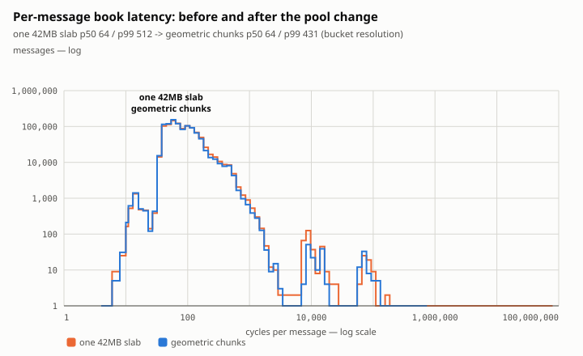
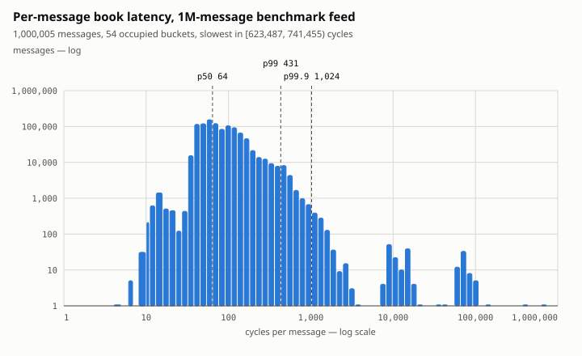
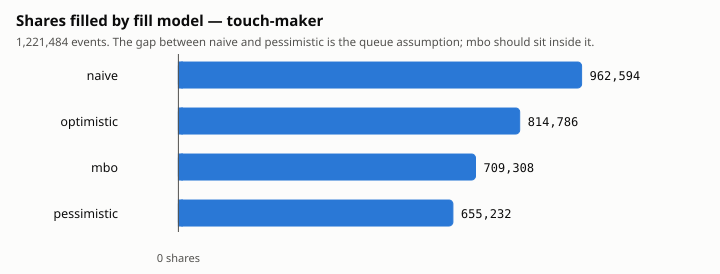

# itchbook

A limit-order-book reconstructor, matching engine, and queue-position-aware
backtester built from raw **NASDAQ TotalView-ITCH 5.0** binary data — in C++20.

> **Status:** Phases 1–9 complete. Every claim below is measured on a real
> NASDAQ trading day, 30 December 2019 — the whole feed where it says so, and
> MSFT's 1,221,484-message slice where the oracle or a vendor bar is the grader.
> **One exception, and it says so where it appears:** the cycles-per-message
> benchmark comes from a generated feed built to that day's message mix, because
> a benchmark has to replay identical messages to mean anything. The wall-clock
> and memory figures for the full day are the real file.
>
> **A whole market, not a symbol.** One process reconstructs **every one of
> 8,906 securities** for 30 December 2019 — 268,744,780 messages, 971 million
> shares — in **44.6 s** at 551 MB, with **zero unknown order references and zero
> locate mismatches across the entire feed**. It took 87 s until a swept load
> factor found **2.42x** in the reference map, against a written prediction that
> the knob would measure flat.
> See [`docs/phase9-results.md`](docs/phase9-results.md).
>
> **Correct.** The framing is checked against a whole day of every symbol —
> **268,744,780 messages, 8.25 GB, no length mismatch**. Replaying one symbol's
> file, the C++ book and an independent Python oracle then agree byte for byte
> across **61,228 snapshot rows and 22 summary fields**, VWAP to ten decimal
> places, zero unknown order references.
> The reconstruction matches **Databento's published daily bar exactly** —
> volume, open, high, low, close, to the share and the cent.
> See [Validation](#validation).
>
> **Fast** — *the one claim here measured on a generated feed, not the real
> day.* **1.73× fewer cycles per message** (43.9M msg/s), traced by hardware
> counter to the pool's slab allocation rather than anything on the hot path:
> the page-fault count matches the removed 41.9 MB slab to 99.5%. Two
> optimisations the plan predicted measured flat. See [`bench/`](bench/).
>
> **Honest about fills.** A symmetric maker at the touch **loses money in all
> four fill models**, with markouts negative at 100 ms, 1 s and 10 s — it is
> being picked off. Shadowing 200 real orders that were pulled part-filled puts
> the truth inside `[pessimistic, optimistic]` **200 times out of 200**, with
> the reference-resolving model exact on every one.
> See [`docs/phase6-results.md`](docs/phase6-results.md).
>
> **Never silently wrong.** Twelve scenarios of packet damage over that day —
> drops, duplicates, reordering, truncation, a 14:00 outage, and a trading halt
> injected into the real stream — and in none of them does the system report a
> trusted book that differs from the truth. The grader is proven able to fail.
> See [`docs/phase7-results.md`](docs/phase7-results.md).

Reconstructing an order book from a raw exchange feed is not hard because the
format is complicated. It is hard because **nothing tells you when you are
wrong**: every message is individually valid, a book that has quietly diverged
looks exactly like one that has not, and the errors are cumulative — a single
mishandled message at 09:31 poisons every number for the rest of the day. So
most of this repository is not the book. It is the machinery for finding out.

## What it's for

Four things this project sets out to prove, in priority order:

1. **Correct binary-protocol handling** — parse a real exchange feed and
   reconstruct book state that matches ground truth exactly.
2. **Empirical performance** — measure, find the bottleneck, fix it, measure
   again, and explain each speedup with a hardware counter.
3. **Market-microstructure understanding** — queue position, adverse selection,
   the gap between a fill you'd *actually* get and one you'd *like* to have.
4. **Systems that fail safely** — gap detection, resync, kill switches.

## Performance

```bash
python3 python/make_bench_feed.py data/raw/bench.gz --messages 1000000
python3 bench/compare.py ./build/book_bench data/raw/bench.gz
```

1,000,000 messages with a real day's message mix (47% `A`, 45% `D`, 4.5% `U`,
2.9% `E`). Per-message figures come from an `rdtsc` pair around each handler,
with the harness's own overhead (~40 cycles, comparable to the work itself)
measured and subtracted. Throughput comes from a separate, completely
uninstrumented replay, so it is the honest end-to-end number.

| | cycles/msg | p50 | p99 | p99.9 | worst single message |
|---|---:|---:|---:|---:|---:|
| baseline | 131.0 | 66 | 368 | 752 | 53,508,092 |
| geometric chunks | **79.6** | 58 | 366 | 728 | **551,020** |

**1.65× faster on this machine, 1.73× on the PMU machine** (142.31 → 82.04
cycles/msg, 25.3M → 43.9M messages/second), and the worst message improves 97×.

### The distribution behind the percentiles

Phase 4's done-condition is a **before/after** histogram, so here is the pool
change as a change in shape rather than as two rows of a table:



```bash
# build the two pools, measure both, draw them on one pair of axes
g++ -std=c++20 -O3 -Iinclude -DITCHBOOK_POOL_FIRST_CHUNK="(1u<<20)" \
    -DITCHBOOK_POOL_MAX_CHUNK="(1u<<20)" tools/book_bench.cpp -lz -o bench_before
./bench_before data/raw/bench.gz --histogram out/before.csv
./build/book_bench data/raw/bench.gz --histogram out/after.csv
python3 python/analysis/latency_histogram.py out/after.csv --compare out/before.csv \
    --labels "one 42MB slab,geometric chunks" \
    --svg docs/figures/latency-histogram-compare.svg
```

The bodies of the two distributions nearly coincide — the steady state was never
the problem — and the whole change is in the right-hand tail, which is exactly
what "the cost was one 42MB slab being faulted in, not the hot path" predicts.
In the container these two runs came from, the worst single message goes from
**63,775,659 cycles to 629,334** and throughput from 16.4M to 26.4M msg/s, while
p99 moves by less than run-to-run noise (493 vs 523 — the wrong way, on this
run). That is the shape of the claim: a tail event removed, not a hot path sped
up. Both runs' full summaries are committed next to the figure as
[`latency-before.json`](docs/figures/latency-before.json) and
[`latency-after.json`](docs/figures/latency-after.json), so every number in this
paragraph is checkable without rerunning anything, along with the bucket
counts each chart is drawn from
([`latency-histogram.csv`](docs/figures/latency-histogram.csv) and
[`latency-histogram-before.csv`](docs/figures/latency-histogram-before.csv)).

The same tool draws one run on its own:



```bash
./build/book_bench data/raw/bench.gz --histogram out/latency.csv
python3 python/analysis/latency_histogram.py out/latency.csv \
    --svg docs/figures/latency-histogram.svg
```

Five numbers cannot show a shape, and the shape is where the argument is. This
run puts **93.9% of a million messages between 32 and 256 cycles** — one broad
mode, the steady state — and then decays smoothly. What the percentile columns
cannot show is how the rest is distributed: p99.9 is 1,173 cycles and the worst
message is 629,334, a factor of **537**, and the entire population at or above
2,000 cycles is **321 messages out of a million**. A tail that is that wide and
that sparse is a rare fault, not a slow path — which is the claim the pool
change rests on, made visible rather than asserted. Both axes are logarithmic
and labelled as such; a linear one is a single bar against the origin and six
screens of white space.

The markers are the same three statistics as the table — p50, p99, p99.9 — but
not the same numbers, and the difference is the point: **these runs come from a
third machine**, the container this repository's checks run in, so its absolute
cycles sit above both columns above. Read the table for this project's hardware
and the figure for the shape, which is the part that transfers. Regenerate it
with the commands above to get your own.

### The counter behind it

Weighted by share, the per-type p50s come to ~62 cycles/msg. Throughput said
**131**. Less than half the time was in the steady state, so the steady state
was not the problem.

The largest single sample was **53 million cycles** — on a one-million-message
replay, one message was 40% of total runtime. That was the pool allocating its
first slab: `1<<20` orders × 40 bytes = **42 MB**, allocated and page-faulted on
the very first `A`. Cost tracks slab size almost exactly and p50 barely moves
across the whole sweep, which is what identifies it as first-touch cost rather
than work:

| first chunk | slab | cycles/msg | worst sample |
|---|---:|---:|---:|
| 2^20 | 41.9 MB | 132.2 | 53,470,476 |
| 2^18 | 10.5 MB | 87.5 | 13,360,790 |
| 2^16 | 2.6 MB | 81.8 | 3,471,238 |
| 2^14 | 0.7 MB | 80.6 | 1,085,922 |
| 2^12 | 0.2 MB | **63.3** | 485,252 |

On hardware with a working PMU the page-fault count **matches the removed
41.9 MB slab to 99.5%**. Chunks now start at 4,096 orders and double to a cap of
262,144: the first allocation is trivial, the chunk count stays O(log n), and
the bulk of orders still land in a few large contiguous blocks. Smallest is not
the answer either — tiny chunks scatter orders across many blocks and cost
locality on a day with hundreds of thousands of live ones.

### Two predicted wins that were not

The build plan named likely optimisations. Two were tried and measured **flat**:
hoisting `A` and `D` ahead of the dispatch switch (−1.5%, slightly *worse* — the
compiler already builds a jump table) and single-probe delete (−0.5%, nothing —
the second probe hits the same cache line). Both reverted. The one that mattered
was not on the list.

### The measurement mistake that came first

The first round of results was wrong, and how it was wrong is the point.
Unpinned, `book_bench` varies **19.3%** between identical invocations —
enough to produce a convincing **12% "speedup" from a change that does
nothing**. Pinned with `taskset`, the spread is **2.0%**, and `bench/compare.py`
now also interleaves the variants (A, B, A, B, never all of A then all of B) so
drift cannot be attributed to the change under test. Anything under ~5% on this
hardware is not a result. Full numbers in [`bench/`](bench/).

## Queue-position backtesting

A public feed tells you a cancel happened at your price. It does not tell you
whether it was ahead of your order or behind it. Ahead means you moved up the
queue; behind means you did not, and nothing in the data resolves it. So the
backtester runs four models over one book in one pass and reports the range:

- **naive** — filled whenever anything trades at your price. What most
  backtests do, and it is the number to distrust.
- **optimistic** — every cancel at your level was ahead of you.
- **pessimistic** — every cancel was behind you; only executions advance you.
- **mbo** — resolve the reference and know. Available because we reconstruct
  the book by order, not by level; it is the check that the band is a band.

```bash
./scripts/real-data-run.sh 12302019.NASDAQ_ITCH50.gz MSFT 50
```

MSFT, 30 December 2019, 1,221,484 messages:

```
model            fills    shares     P&L ($)     c/share   edge c/sh
naive            14995   962,594    -2753.09     -0.2860      0.2649
optimistic       12261   814,786    -3065.75     -0.3763      0.0841
mbo               9892   709,308    -3425.35     -0.4829     -0.1102
pessimistic       8548   655,232    -3154.44     -0.4814     -0.2179

naive reports $401.34 MORE than pessimistic
```




Both panels, because either alone misleads — though not in the direction the
synthetic feed suggested. There, the four models' per-share numbers were nearly
identical and only the share counts separated them. On MSFT the ordering
inverts: per share the models spread **1.69×** (−0.2860 to −0.4829), wider than
the **1.47×** spread in shares filled and much wider than the **1.24×** spread
in total P&L that the first panel shows. So on real data the per-share view is
the *most* discriminating of the three, not the least. Both panels stay, because
the total is what a P&L statement reports and the per-share is what actually
separates the models — and which of them discriminates is itself a thing that
changed between the generated feed and the real one.


The markout chart is the one worth staring at. Four lines, all below zero, all
sloping down: the fills arrive disproportionately just before the price moves
against them. That is adverse selection measured on a real market, and it is
why the strategy loses. On a synthetic feed the same code draws this chart
*above* zero — the generator mean-reverts — which is a reminder of what a
synthetic result is a result about.

Markouts are negative at every horizon and worsen with it — −0.58 c/share at
10 s for naive, −0.23 for pessimistic. The maker is adversely selected, which
is why it loses. On a synthetic feed the same code reports naive at 3.53x
pessimistic's P&L and *positive* markouts; that generator mean-reverts, and
`docs/phase6-results.md` says which of the two sets of numbers means anything.

Also modelled: one-way latency, with queue position computed at arrival and
cancels that are late too, so a fill in the gap between deciding to pull and
actually pulling still happens; markouts at 100 ms / 1 s / 10 s with unresolved
fills counted rather than dropped; and the NASDAQ maker-taker schedule with
Section 31 and TAF, in integer micro-dollars.

The external check is the one that matters. `leave_one_out.py` replays the feed
**unchanged** with a simulated order standing exactly where a real order stood,
and grades the models against what that order actually filled. Over 200 real
MSFT orders that were pulled part-filled — the cases where the answer depends
on queue position — the truth fell inside `[pessimistic, optimistic]` 200 times
out of 200. `mbo` reproduced all 200 exactly; naive over-filled 89 and never
under-filled; pessimistic under-filled 96 and never over-filled. Full numbers,
figures and the limits in
[`docs/phase6-results.md`](docs/phase6-results.md).

## Matching engine

The book replays the market. The engine puts *your* orders into it and decides
what trades.

```cpp
Matcher m;
m.submit({.id = 1, .side = Side::Sell, .price = 100'0000, .quantity = 100});
Result r = m.submit({.id = 2, .side = Side::Buy, .price = 100'5000, .quantity = 100});
// r.filled == 100, and the fill printed at 100'0000 — the resting order's price
```

Limit, market, IOC, FOK, iceberg, stop and stop-limit; self-trade prevention in
cancel-newest, cancel-oldest and cancel-both; and a state machine where an
illegal transition asserts rather than quietly corrupting the share count —
though note that is a plain `assert`, so `-DNDEBUG` removes it and the Release
build recommended below for timing does not carry the check.

Three rules carry most of the behaviour, and none of them is arbitrary:

- **A fill prints at the resting order's price, never the incoming one.** The
  order that was there first set the terms, which is why price improvement goes
  to the taker.
- **Within a price, oldest trades first.** This is the "time" in price-time
  priority, and the reason phase 6 exists at all: your place in that queue
  decides whether you are filled.
- **An iceberg's next slice joins the back of the queue.** Hiding size costs
  priority. If it did not, everyone would hide everything.

### Property fuzzing

```bash
./build/fuzz_matcher --iterations 1000000 --seed 1
```

Random order sequences, with four invariants checked after every operation:
the book is never crossed; shares are conserved per order and in aggregate;
terminal orders hold nothing; and price-time priority holds, checked two ways —
fills at a price come in non-decreasing arrival order, and the front of the
book's queue is always the lowest-sequence order resting there.

That last check compares two mechanisms that share no code: the book maintains
its queue as an intrusive linked list, while arrival sequences are assigned by
the engine and never touched by the book. A bug in either shows up as a
disagreement.

Run to date: **1,000,000 sequences on each of seeds 1–5 — 99.5M operations** —
no invariant violated, with every one of the six order types emitted and the
count reported, because a run that violated nothing because it never exercised
something has not shown anything about it. CI runs a million on every push and
fails if any type goes unemitted.

Stops were the type it never emitted. Adding them found three bugs. A parked
stop firing into an empty book attempted `Accepted -> Rejected`, which the state
machine forbids and which aborted the process. A triggered stop kept the arrival
sequence it was given at submit time, so a stop parked in the morning could
claim priority over orders queued at that price all day. And `fire_stops()`
removed elected stops from its pending list by swapping the back into the gap,
so several stops elected by the same trade rested in the wrong order among
themselves — park 1, 2, 3 and they queue 1, 3, 2. That third one is worth
dwelling on: fixing the sequence *first* stopped the fuzzer reporting it, which
turned a detectable bug into a silent one for exactly as long as it took to
notice. All three have regression tests that fail without their fix.

Input is a byte buffer decoded into operations, so the same file runs under
libFuzzer where its runtime is available:

```bash
clang++ -fsanitize=fuzzer,address -DITCHBOOK_LIBFUZZER \
    -Iinclude tests/fuzz/fuzz_matcher.cpp -o fuzz_libfuzzer
```

## Recovery

A feed is not a file. NASDAQ ships the daily samples already de-MoldUDP'd —
every message present, in order, exactly once — so a book built only against
them has never met a dropped packet, and "it works on the sample file" is not
evidence that it would work on the wire.

So the framing goes back on. `mold_wrap` packages a plain ITCH file into real
MoldUDP64 packets; on a 200k-message feed that is ~4,900 datagrams of about
forty messages each, which is why packet loss differs in kind from message
loss. Then `mold_damage` does to them what a network does, and every scenario
is graded:

```bash
python3 python/analysis/adversarial.py data/sliced/MSFT.gz --build build
```

```
scenario             verdict     lost   gaps    dup  reord  trunc        state
clean                CORRECT        0      0      0      0      0      trusted
drop-1-in-1000          SAFE    1,127     25      0   1505      0   recovering
drop-1-in-100           SAFE   12,199    269      0  12315      0       halted
duplicate-1-in-100   CORRECT        0      0  12199      0      0      trusted
reorder-1-in-100     CORRECT        0      0      0    270      0      trusted
truncate-1-in-500       SAFE    1,341     58      0      0     58   recovering
disconnect-short        SAFE    1,806      1      0     64      0   recovering
disconnect-long         SAFE   18,145      1      0     64      0   recovering
everything              SAFE    4,251     63   2160   3013     15   recovering
disconnect-to-end       SAFE        0      0      0      0      0       halted
halt                 CORRECT        0      0      0      0      0      trusted
halt-and-drop           SAFE    2,620     58      0   3375      0   recovering

CORRECT=4  SAFE=8                    (0 WRONG)
```

The last two are the plan's fifth injection. MSFT did not halt on 30 December
2019, so the halt and its resume are *inserted* into the stream — which shifts
every sequence number after them, and puts a real book and two hours of real
session behind the state change. `halt` staying CORRECT means the transition
costs the book nothing; `halt-and-drop` losing 2,620 messages and reporting
`recovering` means a gap straddling that transition is still seen as a gap.

**CORRECT** means the book matched an undamaged replay and the system said so.
**SAFE** means it did not match and the system said *that*. **WRONG** — a book
that differs while claiming to be trusted — is the one outcome the phase exists
to make impossible, and CI fails on any occurrence.

The outage above lands at a real 14:00. Duplication and reordering are handled
exactly — 12,199 duplicated messages applied once, 270 reordered packets
resolved without one false gap — and a feed losing 269 packets halts rather
than pretending to recover. There is no retransmission service to ask, so
recovery is rebuild-forward, and its guarantee is narrow and precise: the rebuilt book
contains **no wrong orders, only missing ones**. That holds unconditionally.
Whether it re-converges before the close does not: on a synthetic feed it
recovers from a 16,231-message hole to a byte-identical book, and on MSFT it
never converges at all, because a rebuild at 14:00 discards thousands of orders
that keep being cancelled for the rest of the day. The verdicts stay SAFE
throughout — the book differs and the system says so, which is the contract.

The harness also has to be able to fail. Set the convergence bar to a single
clean reference and five scenarios go WRONG — drop-1-in-1000, drop-1-in-100,
truncate-1-in-500, everything and halt-and-drop; that run is in CI too, and must
fail. It found two real bugs, including a stream that *stopped* rather than
ended: 80,235 messages missing, every counter honestly zero, reported clean.
Full write-up in [`docs/phase7-results.md`](docs/phase7-results.md).

### Coming back after the process dies

A gap and a crash lose different things. After a gap the bytes were never
received and nothing on disk brings them back. After a crash the bytes were
processed and what was lost is memory — and memory can be written down. The
property is exact: snapshot at message N, restart, replay from N, and the
result must equal a process that ran straight through. Identical, not close:
same orders, same queue positions, same tape.

It takes two snapshots, because a restart loses two things.
[`snapshot.hpp`](include/itchbook/recover/snapshot.hpp) restores the **market**
— every order at every price, written in fill order because dumping the ref map
in hash order restores the right shares at every level with scrambled priority,
which passes every level-based check and makes every queue model silently
wrong. [`strategy_snapshot.hpp`](include/itchbook/recover/strategy_snapshot.hpp)
restores **position and our own open orders**, each with the `ahead` count it
had reached; an order restored at the front of a queue it never reached fills on
the next print and books money that was never made.

Restoring one without the other is the interesting failure, and it is not a
crash. The book is right, the replay continues, every invariant holds, and the
run reports a P&L for a strategy that spent the afternoon flat. Nothing in the
output says a restart happened.

Two things are deliberately *not* restored, and the header says why: markout
samples whose horizon spans the restart, because the mid at that instant was
never observed by anyone and inventing it would be worse than counting it
unresolved; and the kill switch, because a latched limit is for a human to
re-arm on purpose.

## Architecture

The parser knows nothing about books; the book knows nothing about strategies.
`dispatch.hpp` is the only file that knows both, and it mirrors the oracle's
`apply()` case for case so the two can be read side by side.

Three structures carry the book, and the choice for each is the point:

| Problem | Choice | Why |
|---|---|---|
| `ref -> Order*` | open addressing, linear probing, backward-shift deletion | every E/C/X/D/U carries only a reference, so this is the hottest lookup in the program. A node-based map costs a cache miss per message; tombstones would rot as a day's worth of orders is deleted |
| FIFO at a price | intrusive doubly-linked list | cancel-by-reference is `unlink()` — two pointer writes, no search, no allocation |
| `price -> level` | dense array indexed by tick offset | the few levels near the touch are hit millions of times and stay in L1. Off-band and off-tick prices fall through to a cold `std::map` |
| best bid / ask | index cursor per side | never scanned for; the touch moves one tick at a time, so walking outward is amortised O(1) |

`Order` is 40 bytes with a `static_assert` to keep it that way — that assert is
what will tell you the field reordering in phase 4 actually did something.
Orders come from a slab allocator in fixed chunks that are never reallocated, so
every pointer the levels hold stays valid.

## Reproduce it

Every command below was run from a fresh clone with nothing cached, in order,
and works as written on Linux with Python 3.11 under both Clang and GCC —
[`ci.yml`](.github/workflows/ci.yml) builds `ubuntu-latest` twice, once with
each, and runs the unit tests under both, so that sentence is checked rather
than asserted. macOS is expected to work and is not verified here. Requires a
C++20 compiler, CMake ≥ 3.20,
zlib and Python 3.9+. No third-party libraries: the tests, the fuzzers, the
charts and the analysis are stdlib only, deliberately, so this clones and
builds without a package manager standing in the way.

```bash
# macOS:  brew install cmake zlib
# Ubuntu: sudo apt install build-essential cmake ninja-build zlib1g-dev

git clone https://github.com/KareemJandali/itchbook && cd itchbook
cmake -S . -B build -DCMAKE_BUILD_TYPE=Debug    # Debug turns on ASan + UBSan
cmake --build build -j
ctest --test-dir build --output-on-failure
```

That builds everything and runs the unit and property tests. No market data is
needed for any of it — the generators produce spec-shaped feeds:

```bash
# a small feed, and the tools that read it
python3 python/make_sample.py data/raw/sample.gz
./build/itch_census data/raw/sample.gz
./build/itch_dump   data/raw/sample.gz 10

# the C++ book and the Python oracle over the same bytes, compared
python3 python/make_queue_feed.py data/raw/day.gz --messages 1200000 --gap-ns 20000
./scripts/full-day-differential.sh data/raw/day.gz

# the queue-position backtest, four fill models in one pass
./build/queue_backtest data/raw/day.gz --strategy touch-maker --max-position 1000 \
    --json out.json
python3 python/analysis/fill_comparison.py out.json

# packet damage, graded
python3 python/analysis/adversarial.py data/raw/day.gz --build build

# everything above on a real day, in one pass, then fold the numbers back
# into the docs rather than retyping them
./scripts/real-data-run.sh <day>.NASDAQ_ITCH50.gz MSFT 200
python3 scripts/update-real-numbers.py --out out/real --symbol MSFT
```

For a release build: `cmake -S . -B build -DCMAKE_BUILD_TYPE=Release`, plus
`-DNATIVE=ON` for `-march=native`. Debug is ~10× slower — it has the sanitizers
on — so use Release for anything you intend to time.

### With real data

One command does the whole thing on a NASDAQ day, slicing the symbol out first
because the tools take a single-symbol feed:

```bash
./scripts/real-data-run.sh 12302019.NASDAQ_ITCH50.gz MSFT 200
```

Nothing under `data/` or `out/` is committed — both are gitignored, because both
derive from licensed data.

## Layout

```
include/itchbook/   public headers (this is a library, not an app)
  itch/             reader (gzip stream), messages (field offsets), parser (framing)
  book/             order (40 bytes), level (intrusive FIFO), pool (slab),
                    book (dense tick array + open-addressing ref map),
                    dispatch (the ITCH -> book seam)
  engine/           order types, states, and price-time matching
  sim/              queue models, ledger, markouts, fees, latency, backtest
  mold/             MoldUDP64 packet framing and the gap/duplicate/reorder sequencer
  recover/          gap policy, book + strategy snapshots, halt tracking
  risk/             the kill switch
  bench/            rdtsc timing and latency percentiles
tools/              itch_dump, itch_census, itch_slice, book_replay, book_bench,
                    queue_sim, queue_backtest, latency_sweep, restart_check,
                    mold_wrap, mold_replay, mold_damage,
                    tsc_offset, mold_replay_udp, wire_to_book
python/
  make_sample.py       synthetic spec-shaped feed, so you can run without a download
  make_queue_feed.py   feed with real queue structure, halts and a moving price
  make_bench_feed.py   feed with a real day's message mix, for benchmarking
  make_toxic_feed.py   a feed with a closed form: every fill adverse by exactly 2 ticks
  fuzz_feed.py         adversarial feed generator, for the differential test
  reference/           the oracle: slow, obvious, and correct
    parser.py          framing + one decoder per message type
    book.py            {price: [refs]} + {ref: order}; the seven mutating handlers
    replay.py          driver — snapshot CSV + daily volume/OHLC/VWAP
    queue_sim.py       the queue models again, independently
  analysis/
    book_diff.py       diffs two snapshot CSVs — the differential test
    validate.py        grades a reconstruction against Databento
    leave_one_out.py   shadows real orders and grades the fill models against them
    adversarial.py     packet damage, graded CORRECT / SAFE / CAUTIOUS / WRONG
    scaling_check.py   asserts the backtester stays linear in feed length
    check_cross.py     grades the reconstructed auction prices against NASDAQ's
    latency_histogram.py  renders the bucket CSV, one run or before/after
    fill_comparison.py, markout.py, latency_sweep.py, svgchart.py
bench/              baseline/after JSON, compare.py (A/B with pinning), and
                    regression_check.py — the CI gate that the pool change
                    still pays, by ratio so the runner's speed cancels out
                    rate-sweep.py — offers the feed at a ladder of rates
                    anchored to the feed's own clock, extends itself until
                    something drops, and reports the knee and the max
                    sustainable rate
scripts/            real-data-run.sh, full-day-differential.sh,
                    update-real-numbers.py, render-writeup.py,
                    make-synthetic-feed.py — a spec-shaped ITCH feed owing
                    nothing to NASDAQ, so the pipeline tools are testable on a
                    machine with no market data on it
                    wire-to-book-check.sh — the UDP pipeline must lose nothing,
                    and must notice when it does
                    determinism-gate.sh — the pipeline may reorder time, never
                    effect: its book must equal the synchronous one, byte for
                    byte, across six timing regimes
                    phase10-report.py — the rate-latency tables, generated from
                    the committed sweep and --check'd in CI
tests/              unit, property fuzzers, and the cross-implementation differentials
data/  out/         gitignored — raw feeds, per-symbol slices, generated results
```

## Differential testing

The oracle exists to be disagreed with. Two independent implementations — a
slow, obvious Python one and the C++ one — run over the same bytes, so any
divergence is a bug in one of them.

The headline is a **full trading day**, because that is what the claim was
about and tens of thousands of messages cannot test it:

```bash
./scripts/full-day-differential.sh data/sliced/MSFT.gz
```

```
OK: 61228 snapshot rows identical
22 summary fields identical
```

MSFT, 30 December 2019, 1,221,484 messages. Every sampled instant of the book,
and every cumulative quantity between them — volume, notional, OHLC, VWAP to
ten decimal places. The two comparisons fail differently: two books can agree
at every instant a snapshot samples and still have miscounted in between, which
only the summary catches.

`tests/differential.py` covers the other direction — generated adversarial
feeds, requiring identical snapshot CSVs *and* identical summaries:

```bash
python3 tests/differential.py --binary build/book_replay --seeds 10
```

`fuzz_feed.py` aims at the paths a tidy sample never reaches — prices outside
the dense band and off the tick grid, levels emptied and refilled to make the
cursor walk, add/delete churn to work the ref map's deletion path, executions
larger than the resting size, references that never existed, and a second symbol
on another stock locate. Both implementations run over the same bytes, so any
divergence is a bug in one of them.

### On real data

```bash
# NASDAQ public sample (if the FTP is up):
wget ftp://anonymous:@emi.nasdaq.com/ITCH/01302019.NASDAQ_ITCH50.gz -P data/raw/

./build/itch_census data/raw/01302019.NASDAQ_ITCH50.gz
./build/itch_slice  data/raw/01302019.NASDAQ_ITCH50.gz MSFT data/sliced/MSFT.gz
```

A healthy day is mostly `A`/`D`/`X`/`E`, a few thousand `R` at the top, and a
handful of `S`. Anything wildly off means framing is broken. Alternatives if the
NASDAQ FTP is down: [LOBSTER](https://lobsterdata.com) sample files (also useful
as an oracle) or [Databento](https://databento.com) `XNAS.ITCH` free credits.

## Validation

Everything else in this repo checks the code against itself. The unit tests
check it against hand-derived numbers; the differential test checks the C++
against our own Python oracle. Both would pass happily if our reading of the
ITCH spec were wrong *in the same way in both implementations*. Only an outside
number settles that, and until one has been matched this project knows nothing.

That is phase 2's done-condition, and it is met **with a substitution worth
stating here rather than only in the appendix**: MSFT on 30 Dec 2019 matches
Databento's `XNAS.ITCH` daily bar exactly on all five fields — but the plan
named "NASDAQ's published daily summary" or "LOBSTER's published orderbook
file", and Databento is neither. It is venue-specific, which is the property
that matters, and arguably a stronger oracle since it is a full independent
reconstruction rather than an aggregate; it is also a paid subscription, which
means this particular check is not one a reader can reproduce for free. Why the
two free sources do not answer the question, and what does,
is in [`validation/`](validation/) — along with the one subtlety the first
grading run turned up, and a free check of the auction prices that is still
ungraded.

### Grading a reconstruction

```bash
# 1. slice one mid-liquidity symbol out of a real day and reconstruct it.
#    --utc-day bounds the replay to the window the oracle's bar covers; without
#    it the after-hours tail lands in the next bar and nothing lines up.
./build/itch_slice data/raw/<day>.gz MSFT data/sliced/MSFT.gz
python3 python/reference/replay.py data/sliced/MSFT.gz --symbol MSFT \
    --interval-ms 1000 --utc-day 2019-12-30 --json data/sliced/MSFT.json

# 2. grade it against Databento's published bar for the same venue and day
pip install databento
export DATABENTO_API_KEY=db-...          # never commit this
python3 python/analysis/validate.py data/sliced/MSFT.json \
    --symbol MSFT --date 2019-12-30

# 3. confirm the C++ book agrees, over the WHOLE file this time. book_replay
#    has no --utc-day, and it does not need one: the differential asks whether
#    two implementations agree, not whether either matches a vendor's bucket,
#    so both sides simply run unbounded. Bounding one and not the other is the
#    easy way to get a row-count mismatch that means nothing.
python3 python/reference/replay.py data/sliced/MSFT.gz \
    --snapshots data/sliced/MSFT_book.csv --interval-ms 1000 --quiet
./build/book_replay data/sliced/MSFT.gz \
    --snapshots data/sliced/MSFT_book_cpp.csv --interval-ms 1000
python3 python/analysis/book_diff.py \
    data/sliced/MSFT_book.csv data/sliced/MSFT_book_cpp.csv

# ...or just run both of those and the summary comparison in one go:
./scripts/full-day-differential.sh data/sliced/MSFT.gz
```

`validate.py --cost-only` prints what the query would bill before spending
anything, and `--oracle-json` re-runs the comparison offline against a fetch you
already paid for.

Passing means volume and OHLC match **exactly**. A book that is a few thousand
shares off is a book with a bug in it.

### The check that needs no subscription

The grading above requires a Databento key, which means the headline
verification is not something a reader can reproduce for free. One NASDAQ figure
survives that objection: the **official opening and closing prices**. Both are
auctions, both arrive in the feed as `Q` cross trades, and for a NASDAQ-listed
stock the official closing price *is* the closing cross — so any published quote
history settles it.

```bash
python3 python/analysis/check_cross.py validation/MSFT_2019-12-30.json \
    --official-close 157.59 --source "nasdaq.com historical quotes"
```

```
auction                 ours   published  verdict
----------------------------------------------------
official close      157.5900      157.59  match
```

**Done, and it matches to the cent** against nasdaq.com's own historical-quotes
CSV. This is a real test rather than a formality: cross handling is the part of
an ITCH book most likely to be quietly wrong, because it is rare, it is a
separate message type, and nothing in a day's ordinary flow exercises it.

The *opening* cross is not checkable from that source, and working out why was
worth more than the check. Its `Open` column gives $158.987 — a sub-penny
price, which an auction cannot print, since crosses clear at a single price
built from orders priced in pennies. So that column is some other quantity,
most likely the first consolidated print. An earlier version of this script
compared at two decimals, rounded $158.987 to $158.99, and reported a match
against our $158.9900; it now refuses a figure that is not on a penny increment
and explains why. [`validation/`](validation/) has the full record.

### Two things worth knowing before you start

**Databento is the oracle, not the input.** It serves normalised DBN, not raw
ITCH 5.0 binary, so it cannot feed this parser — the point is to prove *our*
parser reads the wire format correctly. The feed itself still has to come from
NASDAQ's public FTP (`emi.nasdaq.com/ITCH/`) or another source of the original
binary.

**Do not grade against a retail quote source.** Yahoo, Google and friends report
*consolidated* volume across every US venue and dark pool. This reconstruction
is NASDAQ-only, which is a fraction of that, so a consolidated figure will look
like a catastrophic failure when the code is fine. Databento's `XNAS.ITCH` bar
is built from the same feed we parse, which is exactly why it is the right
comparison. LOBSTER is an even stronger oracle in principle — same source,
comparable level for level rather than in aggregate — but it publishes
reconstructed output rather than the raw input, so it only works if you can get
a raw ITCH day for the same symbol *and* date as one of their samples.

### When it does not match

Debug roughly in this order:

| Symptom | Likely cause |
|---|---|
| Short a few percent, book looks right | `P`/`Q` volume — hidden and cross executions are real volume that never appears as a displayed order |
| Short by a lot | the locate filter is dropping messages, or the symbol resolved to the wrong locate code |
| Slightly over | non-printable `C` executions being counted; they move the book but not the volume |
| OHLC off but volume right | the opening and closing crosses, which set the official open and close |

## Write-up

[**What synthetic data hides**](docs/writing/what-synthetic-data-hides.md) —
eight times a number in this project was true on a generated feed and false in
reality, what each mechanism turned out to be, and what I would do differently.
The 3.67× headline that was a fact about my generator; three presentation bugs
that all lied in the same direction; a receiver reporting a clean session having
lost 40% of the day; a recovery criterion that could never fire on a real book;
and a property fuzzer that reported a million clean sequences over an engine it
was exercising two thirds of.

A rendered copy sits beside it as
[`what-synthetic-data-hides.html`](docs/writing/what-synthetic-data-hides.html),
regenerated from the Markdown by `scripts/render-writeup.py` so the two cannot
drift.

## License

MIT — see [LICENSE](LICENSE).
