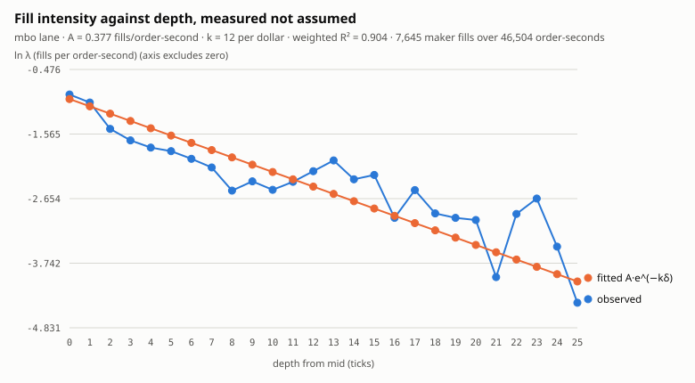
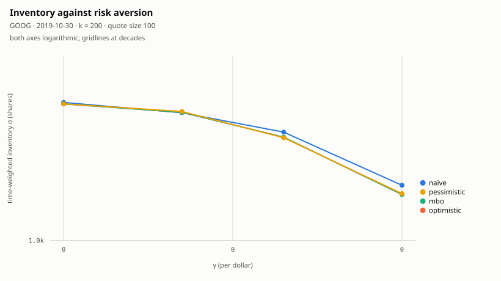
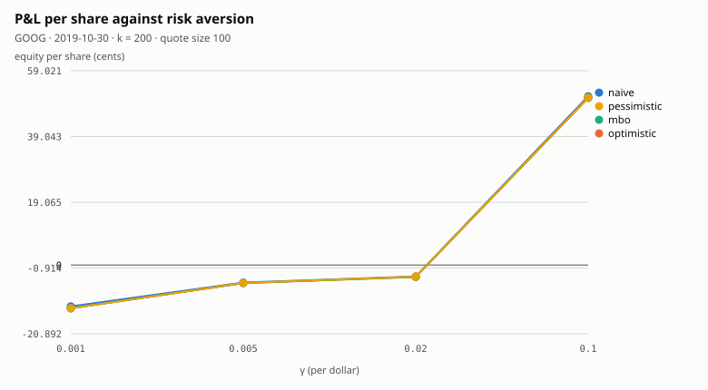

# Avellaneda–Stoikov on NASDAQ TotalView-ITCH, with fill-model uncertainty bands

*Kareem Jandali · École de technologie supérieure*

<!-- generated:status:begin -->

> **Status: run.** 3 symbols (GOOG, MSFT, STOR) over 3 evaluation days from real NASDAQ TotalView-ITCH 5.0, with 2019-08-30 held out to fit λ(δ) from measured fills, per symbol and per lane. That meets the pre-registered scope of ≥ 3 symbols and ≥ 3 evaluation days. Every number and every verdict below §6 is generated from committed artifacts by `scripts/paper-report.py`; none is typed. The conclusion is in §8 and the pre-registered predictions are graded — kept and falsified alike — in §7.5.

<!-- generated:status:end -->

---

## 1. Abstract

Avellaneda–Stoikov (2008) prices a market maker's quotes around a *reservation
price* displaced by inventory, and needs a fill-intensity curve
λ(δ) = A·e^(−kδ) to set its spread. Implementations almost universally **assume**
A and k. This paper measures them, from the author's own simulated fills, through
a queue-position-resolved order-book model built directly from NASDAQ
TotalView-ITCH 5.0 message data.

Two methodological claims carry the work. First, fill-model uncertainty is
reported as a **band over worlds** rather than a band over gradings of one world
— a distinction that is usually elided and that changes what the band means (§4).
Second, the intensity curve is measured **per fill model**, because λ̂ is
estimated *through* a queue model and is therefore conditional on it (§6).

The headline question is deliberately small: *does inventory-aware quoting lose
less than naive symmetric quoting, and through which mechanism* — fewer toxic
fills, or smaller inventory excursions? A three-arm design separates the effect
of the **spread choice** from the effect of the **inventory skew**, which a
two-arm comparison bundles together (§7).

<!-- generated:findings:begin -->

**The answer, over 3 symbols and 3 evaluation days, is no.** A-S captures less half-spread per share than a naive touch maker in 36 of 36 symbol-day-lane cells and goes outright negative in 16, while holding a median 75% less inventory — it buys inventory control with adverse selection, which is the reverse of the pre-registered prediction. The mechanism runs through the tick: measured k sets A-S's inventory-free half-spread, and §8.3 tests whether the sign of its captured edge follows from whether that half-spread fits on the venue's price grid. Assuming k, as implementations almost universally do, is what keeps that question from being asked.

<!-- generated:findings:end -->

## 2. Data and venue

NASDAQ TotalView-ITCH 5.0, the exchange's own binary message feed: every
displayed order add, execute, cancel, delete and replace, with nanosecond
timestamps, for every security on the venue. The reconstruction is from raw
messages — no vendor's book, no bar data, no snapshots.

What this feed **is not** bounds everything downstream, so it is stated here
rather than in the limitations:

- **Displayed liquidity only.** Hidden and midpoint orders never appear as
  resting size. They appear only when they trade, as non-attributed executions.
  A book reconstructed from this feed is the *displayed* book, and a strategy
  evaluated against it is competing with less than the real queue.
- **One venue.** US equities trade across more than a dozen. Order flow this
  paper never sees was routed elsewhere, and the NBBO is not reconstructible
  from NASDAQ alone.
- **No principal identity.** Orders are anonymous, so nothing here can
  distinguish informed from uninformed counterparties directly. Adverse
  selection is inferred from markouts, never observed.

Correctness of the reconstruction is established independently of this paper: a
C++ book and an independent Python reference implementation must produce
byte-identical snapshots over a full trading day, and CI enforces it.

## 3. Fill models

A backtest of a passive strategy has no ground truth about its own fills. The
order rested; whether it *would have* traded depends on where it sat in a queue
nobody recorded. This project carries four models rather than choosing one:

| model | assumption |
|---|---|
| **naive** | any trade at our price fills us |
| **optimistic** | we are at the front of the queue |
| **mbo** | queue position tracked from message-by-message data, with the set of references resting ahead of us at arrival |
| **pessimistic** | we are at the back of the queue |

`mbo` is the one that uses the information the feed actually contains; the other
three bracket it. The spread between them is not error to be minimised — it is
the honest width of what a passive backtest can claim.

## 4. The feedback wall, and what the band now means

This is the section the rest of the paper depends on, and it is where published
results are most often ambiguous.

**Phase 6's band is four gradings of one world.** A strategy that cannot see its
fills emits one intent stream; four fill models score that identical stream four
ways. The difference between lanes is attributable to the model alone — not by
argument but *structurally*, because no feedback path exists by which the
decisions could have differed.

**That construction is impossible for an inventory-aware strategy.** A-S's
reservation price is a function of inventory `q`, and inventory is a function of
fills. A strategy in the pessimistic lane gets fewer fills, carries different
inventory, quotes differently, and fills differently again. The lanes diverge
from the first fill onward, and there is no longer one intent stream to grade.

**So the band becomes four closed-loop runs — a band over worlds.** Each is a
complete, internally consistent answer to *what would this strategy have done if
fills worked like this*. It is wider than the phase-6 band for a reason that is
not noise: it now includes the strategy's own reaction to being filled
differently.

Both constructions are legitimate and they answer different questions. Phase 6
asks how much the fill model matters to the *score* of a fixed strategy; this
paper asks how much it matters to a strategy that *reacts*. Reporting one while
describing the other would be the single most misleading thing this work could
do, so the two live in separate code paths — `backtest.hpp` and
`closed_loop.hpp` — and produce differently-labelled output.

**Half the wall stays up.** The strategy is told its fills and its position. It
is *not* told its queue position: `SimFill` carries the shares resting ahead of
it at arrival, and the `FillEvent` handed to a strategy deliberately does not
copy that field. It is the estimate whose error bars are the entire subject of
§3, and a strategy conditioning on it would be conditioning on the thing being
measured. The omission is enforced by a compile-time assertion.

## 5. Strategy

Finite-horizon Avellaneda–Stoikov:

- reservation price **r(s, q, t) = s − q·γ·σ²·(T − t)**
- total spread **δᵃ + δᵇ = γ·σ²·(T − t) + (2/γ)·ln(1 + γ/k)**, split
  symmetrically about r

σ is estimated online from the realised variance of **mid changes**, not
returns: A-S models arithmetic Brownian motion, so the volatility it wants is in
dollars per root-second. Sampling is on a fixed time grid rather than per
message, because per-message sampling makes the estimate a function of how busy
the symbol is.

### 5.1 Units, and a trap

The paper's two terms are not dimensionally consistent unless inventory is
treated as a dimensionless count: the spread term requires γ in 1/price, the
reservation term in 1/(shares·price). Implementations resolve this silently and
differently, which is part of why published A-S results are hard to compare.
Here it is resolved explicitly — dollars and seconds throughout, γ in 1/dollar in
both terms, and inventory entering as `q / inventory_unit`, a named parameter
that is reported rather than buried.

The consequence of leaving it implicit is not subtle. Avellaneda and Stoikov's
worked example uses γ = 0.1, k = 1.5 in arbitrary units. The intensity term is
approximately `2/k` for small γ/k, so k = 1.5 **per dollar** implies a total
spread of about **170 ticks** on a book that quotes one wide. Ported unchanged to
a penny-spread equity, the strategy quotes all day and never fills. This
implementation did exactly that on its first run; a regression test now asserts
both that the corrected defaults are sane and that the paper's values are the
trap, so the fix cannot be silently reverted.

### 5.2 A known pathology, flagged rather than mitigated

As t → T the inventory term decays to zero, so the model stops skewing for
inventory precisely when it has least time left to unload it. This follows from
the finite-horizon formulation, which assumes terminal inventory is liquidated at
the mid — something no desk can do. A floor on (T − t) is available as a
mitigation and **defaults to off**, so the pathology is visible in the results
rather than papered over, and the strategy counts quotes placed in the last tenth
of the session while holding inventory. Guéant–Lehalle–Fernandez-Tapia's
inventory-bounded variant is the principled fix and is not implemented here.

## 6. Calibrating λ(δ)

λ̂(δ) = fills(δ) / exposure(δ), where exposure is integrated **per order** over
time: two orders resting one second at the same depth is two order-seconds,
because λ is the intensity for a single order.

Four things are excluded from the denominator, each of which would bias k in a
determinate direction: time when the symbol is not tradable, time when the mid is
unusable, hidden iceberg reserve (in no queue, and so not exposed), and orders
that are no longer live. Depth is **integrated, not assigned at placement** — the
mid moves while an order rests, so a single order migrates between depth buckets
during its life. Taker fills are excluded entirely: λ(δ) describes a resting
order being hit, and crossing the spread is a decision rather than an arrival.

The fit is log-linear and **Poisson-weighted** — a bucket's fill count is a
count, so var(ln λ̂) ≈ 1/fills. Buckets with exposure but zero fills cannot be
logged, are excluded, and are **counted**: dropping them silently flattens the
curve, because the deep buckets are exactly the ones that fail to fill.

### 6.1 The conditioning decision

λ̂ is measured *through* a queue model, so A and k are properties of (this feed,
this strategy, **that model**). Calibrating once under one model and evaluating
four would leave three lanes using a fill curve fitted in a world they do not
inhabit — reintroducing precisely the cross-contamination the closed-loop design
removes.

**This work calibrates per lane.** Four passes, four curves, and the artifact
records `calibrated_per_lane` so a reader never has to infer it. The cost is
stated: four passes instead of one, and a band that now carries variation from
two sources — different fills *and* different fitted parameters — which is the
price of each world being internally consistent.

**And per symbol**, which was not obvious until the spreads were measured. On a
single real session the mean touch spread ran from 1.0 ticks on a $31 name —
pinned at one tick 99.2% of the session, behind a 3,600-share queue — to 60.7
ticks on a $1,189 name with 50 shares at the touch. Those are 61× apart in
spread and 62× apart in queue depth, in opposite directions. A fill-intensity
curve fitted on one of them describes nothing about the other, so k is fitted
once per symbol on the calibration day and frozen.

Both dimensions were being silently collapsed until then. The experiment tool
took `k` as a single scalar and applied it to every lane and every symbol, and
its own banner printed *"assumed k"* — honest about what it was doing, but never
connected to the calibrator, because until there was real data every synthetic
symbol looked alike. k now reaches the experiment **from the committed
calibration artifact and never from a flag typed by hand**: the driver refuses a
symbol with no calibration, a calibration whose recorded day is a day being
evaluated, and a lane whose intensity could not be fitted. Running with the
placeholder is still possible for smoke tests, and stamps every artifact it
produces `k_source: assumed-scalar`.

### 6.2 The touch misfit

A-S assumes fill intensity depends only on depth. At δ = 0 it depends mostly on
**queue position**, which the exponential has no way to express, so the touch
bucket is expected to sit below the fitted curve. This is a known limitation of
the model and the residual figure is the evidence for it rather than an assertion
about it.

### 6.3 What the fit came out as

<!-- generated:calibration:begin -->

k is fitted **per symbol and per lane**, and both dimensions are load-bearing. Per lane because λ̂ is estimated *through* a queue model and is therefore conditional on it (§6.1). Per symbol because measured spreads on a single session ran from 1.0 ticks to 60.7 — a curve fitted on one of those describes nothing about the other.

**AMD** · calibrated 2019-08-30 · `calibrated_per_lane`: `true`

| lane | A | k (1/$) | R² | buckets fitted | exposure, no fills | maker fills | exposure (order-seconds) |
|---|---:|---:|---:|---:|---:|---:|---:|
| **naive** | 0.1402 | 483.9 | 0.984 | 3 | 7 | 1,392 | 46,772 |
| **optimistic** | — | — | — | 2 | 8 | 1,182 | 46,780 |
| **mbo** | — | — | — | 2 | 8 | 1,000 | 46,794 |
| **pessimistic** | — | — | — | 2 | 8 | 916 | 46,798 |

Across lanes k spans 483.9 to 483.9 — 1.00×. That factor is the §6.1 cost as a number: one fit reused across four lanes hands three of them a curve from a market they do not live in.

7 bucket(s) had exposure and no fills and are excluded from the fit. Reported because dropping them silently flattens the curve — the deep buckets are exactly the ones that fail to fill.

**GOOG** · calibrated 2019-08-30 · `calibrated_per_lane`: `true`

| lane | A | k (1/$) | R² | buckets fitted | exposure, no fills | maker fills | exposure (order-seconds) |
|---|---:|---:|---:|---:|---:|---:|---:|
| **naive** | 0.3870 | 11.9 | 0.901 | 26 | 0 | 8,014 | 46,631 |
| **optimistic** | 0.3773 | 12.3 | 0.904 | 26 | 0 | 7,645 | 46,504 |
| **mbo** | 0.3773 | 12.3 | 0.904 | 26 | 0 | 7,645 | 46,504 |
| **pessimistic** | 0.3773 | 12.3 | 0.904 | 26 | 0 | 7,645 | 46,504 |

Across lanes k spans 11.9 to 12.3 — 1.04×. That factor is the §6.1 cost as a number: one fit reused across four lanes hands three of them a curve from a market they do not live in.

**MSFT** · calibrated 2019-08-30 · `calibrated_per_lane`: `true`

| lane | A | k (1/$) | R² | buckets fitted | exposure, no fills | maker fills | exposure (order-seconds) |
|---|---:|---:|---:|---:|---:|---:|---:|
| **naive** | 0.6991 | 257.0 | 0.995 | 5 | 21 | 8,216 | 46,731 |
| **optimistic** | 0.6038 | 319.0 | 0.981 | 5 | 21 | 6,404 | 46,748 |
| **mbo** | 0.5094 | 335.5 | 0.962 | 5 | 21 | 5,287 | 46,772 |
| **pessimistic** | 0.4769 | 341.9 | 0.955 | 5 | 21 | 4,955 | 46,781 |

Across lanes k spans 257.0 to 341.9 — 1.33×. That factor is the §6.1 cost as a number: one fit reused across four lanes hands three of them a curve from a market they do not live in.

84 bucket(s) had exposure and no fills and are excluded from the fit. Reported because dropping them silently flattens the curve — the deep buckets are exactly the ones that fail to fill.

**STOR** · calibrated 2019-08-30 · `calibrated_per_lane`: `true`

| lane | A | k (1/$) | R² | buckets fitted | exposure, no fills | maker fills | exposure (order-seconds) |
|---|---:|---:|---:|---:|---:|---:|---:|
| **naive** | 0.0415 | 171.3 | 0.642 | 6 | 12 | 624 | 46,537 |
| **optimistic** | 0.0366 | 225.4 | 0.768 | 5 | 13 | 530 | 46,563 |
| **mbo** | 0.0326 | 206.9 | 0.687 | 5 | 13 | 460 | 46,607 |
| **pessimistic** | 0.0302 | 200.1 | 0.685 | 5 | 13 | 475 | 46,636 |

Across lanes k spans 171.3 to 225.4 — 1.32×. That factor is the §6.1 cost as a number: one fit reused across four lanes hands three of them a curve from a market they do not live in.

51 bucket(s) had exposure and no fills and are excluded from the fit. Reported because dropping them silently flattens the curve — the deep buckets are exactly the ones that fail to fill.

Across all 4 symbols and their lanes, k spans 11.9 to 483.9. A single scalar over that range is not a parameter.




*Observed ln λ̂ per depth bucket against the fitted A·e^(−kδ), GOOG · 2019-08-30 · mbo lane. The touch bucket is the §6.2 misfit.*

<!-- generated:calibration:end -->

## 7. Experimental design

**Three arms**, because two cannot answer the question:

| arm | what it is |
|---|---|
| `symmetric-touch` | quote the touch, both sides, ignore inventory — the naive baseline |
| `as-gamma0` | A-S with the inventory skew **off**: same spread formula, same re-quote discipline, same size |
| `as` | A-S proper, at each swept γ |

The middle arm is the control. A-S differs from a touch-maker in inventory
awareness *and* in where it quotes *and* in how often it re-quotes; an
improvement over the touch-maker could come from any of the three. Comparing
against γ = 0 holds everything fixed except the skew, so **"A-S beats a naive
maker"** and **"the skew is what beat it"** remain separable claims. They are
routinely reported as one.

γ = 0 is handled by taking the limit — `(2/γ)·ln(1 + γ/k) → 2/k` — rather than
refusing the input, so the control stays inside the same code path as the
treatment.

Every headline number is a band across the four fill models. γ is **swept and
plotted**, never chosen. Results are reported **per symbol-day and never pooled**:
with a handful of symbol-days there is no significance to claim, and an average
invites exactly the claim the data cannot support. Calibration and evaluation
**never share a day** — the driver exits non-zero rather than warning if they do.

<!-- generated:results:begin -->

3 symbol(s) — GOOG, MSFT, STOR — over 3 evaluation day(s), with 2019-08-30 held out as the calibration day. Quote size 100, modelled latency 0 ns. γ is swept over 0.001, 0.005, 0.02, 0.1; the tables below fix γ = 0.02 and the sweep itself is the figure.

k used, per symbol and lane — from the committed calibration artifacts, never from a flag typed by hand:

| symbol | naive | optimistic | mbo | pessimistic | spread |
|---|---:|---:|---:|---:|---:|
| GOOG | 11.9 | 12.3 | 12.3 | 12.3 | 1.04× |
| MSFT | 257.0 | 319.0 | 335.5 | 341.9 | 1.33× |
| STOR | 171.3 | 225.4 | 206.9 | 200.1 | 1.32× |

### 7.1 Headline band, per symbol-day

**Edge, not equity, is the market-making result.** `equity = edge + drift − fees`: edge is half-spread captured against the mid at fill time, drift is what the mid did to inventory, including the residual position marked at the close. On GOOG drift is a median 86% of equity and ranges over -153,774 to 2,450,158 µ$ per share across days — a spread 70× as wide as the edge's own 139,804 to 177,184. One is a property of the strategy, the other of the stock. Equity is still shown, because the pre-registered predictions were written against it and are graded against it in §7.5.

All figures µ$ per share. `mk 1s` is the 1-second markout — negative is adverse selection. Never pooled: each table is one symbol-day.

**GOOG · 2019-10-30**

| lane | **edge touch** | **edge γ=0** | **edge A-S** | eq touch | eq A-S | max\|q\| touch | max\|q\| A-S | mk 1s A-S |
|---|---:|---:|---:|---:|---:|---:|---:|---:|
| naive | 142,677 | 55,176 | 22,067 | 197,098 | -34,683 | 19,159 | 5,352 | -77,612 |
| optimistic | 148,966 | 54,608 | 12,831 | 470,329 | -36,153 | 2,185 | 5,162 | -86,203 |
| mbo | 147,506 | 54,608 | 12,831 | 489,384 | -36,153 | 2,103 | 5,162 | -86,203 |
| pessimistic | 146,518 | 54,609 | 14,354 | 370,438 | -35,193 | 2,172 | 5,144 | -83,855 |

Edge band width (max − min over the four lanes, scaled by the median |edge|): touch-maker 0.04, A-S 0.68.

**GOOG · 2019-12-30**

| lane | **edge touch** | **edge γ=0** | **edge A-S** | eq touch | eq A-S | max\|q\| touch | max\|q\| A-S | mk 1s A-S |
|---|---:|---:|---:|---:|---:|---:|---:|---:|
| naive | 139,804 | 62,445 | 71,447 | 99,681 | -48,144 | 19,470 | 1,213 | -21,875 |
| optimistic | 151,016 | 62,062 | 65,823 | 950,454 | -62,202 | 2,970 | 1,212 | -31,049 |
| mbo | 150,937 | 62,065 | 65,768 | 983,849 | -62,495 | 2,614 | 1,215 | -31,186 |
| pessimistic | 148,137 | 62,064 | 65,785 | 1,047,199 | -63,873 | 2,398 | 1,215 | -31,230 |

Edge band width (max − min over the four lanes, scaled by the median |edge|): touch-maker 0.07, A-S 0.09.

**GOOG · 2020-01-30**

| lane | **edge touch** | **edge γ=0** | **edge A-S** | eq touch | eq A-S | max\|q\| touch | max\|q\| A-S | mk 1s A-S |
|---|---:|---:|---:|---:|---:|---:|---:|---:|
| naive | 173,617 | 48,322 | 47,963 | 5,573 | 45,753 | 16,144 | 2,943 | -14,977 |
| optimistic | 172,843 | 48,089 | 41,434 | 2,611,597 | 47,141 | 2,824 | 2,887 | -17,766 |
| mbo | 177,184 | 48,083 | 41,434 | 1,938,497 | 47,141 | 2,177 | 2,887 | -17,766 |
| pessimistic | 174,050 | 48,083 | 41,498 | 1,994,683 | 46,780 | 2,170 | 2,887 | -17,476 |

Edge band width (max − min over the four lanes, scaled by the median |edge|): touch-maker 0.02, A-S 0.16.

**MSFT · 2019-10-30**

| lane | **edge touch** | **edge γ=0** | **edge A-S** | eq touch | eq A-S | max\|q\| touch | max\|q\| A-S | mk 1s A-S |
|---|---:|---:|---:|---:|---:|---:|---:|---:|
| naive | 5,239 | 3,305 | 3,651 | 31,615 | -1,137 | 38,070 | 7,350 | -1,872 |
| optimistic | 3,712 | -379 | 280 | 26,626 | -3,676 | 24,688 | 6,278 | -3,279 |
| mbo | 3,382 | -869 | -563 | 39,129 | -3,731 | 20,935 | 5,444 | -3,647 |
| pessimistic | 3,356 | -1,266 | -1,238 | 60,155 | -4,063 | 23,503 | 4,987 | -3,791 |

Edge band width (max − min over the four lanes, scaled by the median |edge|): touch-maker 0.53, A-S 5.43.

**MSFT · 2019-12-30**

| lane | **edge touch** | **edge γ=0** | **edge A-S** | eq touch | eq A-S | max\|q\| touch | max\|q\| A-S | mk 1s A-S |
|---|---:|---:|---:|---:|---:|---:|---:|---:|
| naive | 4,172 | 3,361 | 974 | -17,339 | -7,154 | 19,662 | 12,039 | -4,046 |
| optimistic | 3,531 | -456 | -8,643 | -11,554 | -6,534 | 10,744 | 3,841 | -11,830 |
| mbo | 3,149 | -1,096 | -10,843 | -14,041 | -7,173 | 25,735 | 3,624 | -13,549 |
| pessimistic | 3,144 | -1,724 | -12,561 | -16,562 | -8,762 | 20,726 | 6,043 | -14,573 |

Edge band width (max − min over the four lanes, scaled by the median |edge|): touch-maker 0.31, A-S 1.39.

**MSFT · 2020-01-30**

| lane | **edge touch** | **edge γ=0** | **edge A-S** | eq touch | eq A-S | max\|q\| touch | max\|q\| A-S | mk 1s A-S |
|---|---:|---:|---:|---:|---:|---:|---:|---:|
| naive | 6,680 | 3,676 | 3,001 | 43,150 | -3,190 | 195,406 | 11,237 | -5,679 |
| optimistic | 4,749 | 559 | 103 | 40,560 | -5,838 | 49,606 | 10,793 | -7,351 |
| mbo | 4,655 | 331 | -448 | 59,519 | -7,038 | 61,593 | 11,366 | -8,166 |
| pessimistic | 4,700 | 188 | -440 | 72,701 | -7,156 | 72,948 | 11,308 | -8,067 |

Edge band width (max − min over the four lanes, scaled by the median |edge|): touch-maker 0.43, A-S 7.77.

**STOR · 2019-10-30**

| lane | **edge touch** | **edge γ=0** | **edge A-S** | eq touch | eq A-S | max\|q\| touch | max\|q\| A-S | mk 1s A-S |
|---|---:|---:|---:|---:|---:|---:|---:|---:|
| naive | 3,614 | 1,517 | 2,010 | -43,064 | -6,819 | 14,747 | 1,433 | -4,645 |
| optimistic | 3,772 | -2,496 | -851 | -45,246 | -4,552 | 8,413 | 1,973 | -5,010 |
| mbo | 3,380 | -2,996 | -1,316 | -53,364 | -5,433 | 8,871 | 1,209 | -5,170 |
| pessimistic | 2,934 | -3,551 | -2,105 | -72,989 | -5,503 | 8,985 | 465 | -6,647 |

Edge band width (max − min over the four lanes, scaled by the median |edge|): touch-maker 0.24, A-S 2.47.

**STOR · 2019-12-30**

| lane | **edge touch** | **edge γ=0** | **edge A-S** | eq touch | eq A-S | max\|q\| touch | max\|q\| A-S | mk 1s A-S |
|---|---:|---:|---:|---:|---:|---:|---:|---:|
| naive | 3,746 | 2,270 | 1,633 | 1,643 | -7,892 | 5,136 | 1,244 | -4,390 |
| optimistic | 3,743 | -1,728 | -472 | -8,194 | -3,058 | 3,340 | 887 | -4,592 |
| mbo | 3,268 | -2,321 | -1,046 | -15,605 | -2,712 | 3,506 | 565 | -5,100 |
| pessimistic | 3,039 | -2,974 | -1,838 | -12,123 | -4,906 | 1,921 | 428 | -5,994 |

Edge band width (max − min over the four lanes, scaled by the median |edge|): touch-maker 0.20, A-S 2.59.

**STOR · 2020-01-30**

| lane | **edge touch** | **edge γ=0** | **edge A-S** | eq touch | eq A-S | max\|q\| touch | max\|q\| A-S | mk 1s A-S |
|---|---:|---:|---:|---:|---:|---:|---:|---:|
| naive | 4,325 | -3,263 | 1,180 | -3,051 | -3,466 | 3,256 | 555 | -3,921 |
| optimistic | 3,840 | -3,700 | -329 | -13,569 | -8,923 | 2,988 | 1,690 | -4,950 |
| mbo | 3,397 | -4,495 | -1,048 | -18,166 | -6,717 | 2,997 | 943 | -5,234 |
| pessimistic | 3,321 | -4,869 | -2,131 | -25,228 | -6,598 | 3,291 | 450 | -6,060 |

Edge band width (max − min over the four lanes, scaled by the median |edge|): touch-maker 0.28, A-S 2.97.

### 7.2 Mechanism: which gap is which

`touch → γ=0` is the **spread choice**; `γ=0 → A-S` is the **inventory skew**. A two-arm comparison bundles them, and the bundled number is what gets reported as "A-S wins". Δ is A-S-side minus baseline-side.

**Decomposed on edge.** Differencing equity between arms differences their drift too, and the arms hold deliberately different amounts of inventory — the skew arm exists to hold less. Scoring the mechanism on a drift-carrying metric would credit or blame the treatment for the stock's direction.

| symbol | day | lane | Δedge spread | Δedge skew | Δinv sd spread | Δinv sd skew |
|---|---|---|---:|---:|---:|---:|
| GOOG | 2019-10-30 | naive | -87,501 | -33,109 | -2,975.7 | -2,866.4 |
| GOOG | 2019-10-30 | optimistic | -94,358 | -41,777 | 4,556.3 | -3,131.1 |
| GOOG | 2019-10-30 | mbo | -92,898 | -41,777 | 4,576.6 | -3,131.1 |
| GOOG | 2019-10-30 | pessimistic | -91,909 | -40,255 | 4,525.2 | -3,134.7 |
| GOOG | 2019-12-30 | naive | -77,359 | 9,002 | 6,240.3 | -13,736.0 |
| GOOG | 2019-12-30 | optimistic | -88,954 | 3,761 | 13,628.1 | -14,575.7 |
| GOOG | 2019-12-30 | mbo | -88,872 | 3,703 | 13,773.5 | -14,582.1 |
| GOOG | 2019-12-30 | pessimistic | -86,073 | 3,721 | 13,871.1 | -14,580.5 |
| GOOG | 2020-01-30 | naive | -125,295 | -359 | 819.8 | -6,942.2 |
| GOOG | 2020-01-30 | optimistic | -124,754 | -6,655 | 7,197.2 | -6,853.4 |
| GOOG | 2020-01-30 | mbo | -129,101 | -6,649 | 7,355.7 | -6,831.9 |
| GOOG | 2020-01-30 | pessimistic | -125,967 | -6,585 | 7,369.7 | -6,831.9 |
| MSFT | 2019-10-30 | naive | -1,934 | 346 | 29,313.2 | -42,217.7 |
| MSFT | 2019-10-30 | optimistic | -4,091 | 659 | 11,795.7 | -17,397.8 |
| MSFT | 2019-10-30 | mbo | -4,251 | 306 | 14,672.1 | -20,934.2 |
| MSFT | 2019-10-30 | pessimistic | -4,622 | 28 | 13,076.4 | -19,532.1 |
| MSFT | 2019-12-30 | naive | -811 | -2,387 | 25,068.5 | -27,140.6 |
| MSFT | 2019-12-30 | optimistic | -3,987 | -8,187 | 3,812.5 | -7,238.6 |
| MSFT | 2019-12-30 | mbo | -4,245 | -9,747 | -4,990.6 | -5,030.2 |
| MSFT | 2019-12-30 | pessimistic | -4,868 | -10,837 | -3,848.6 | -2,161.1 |
| MSFT | 2020-01-30 | naive | -3,004 | -675 | 215,155.2 | -297,912.2 |
| MSFT | 2020-01-30 | optimistic | -4,190 | -456 | 65,959.7 | -85,914.3 |
| MSFT | 2020-01-30 | mbo | -4,324 | -779 | 64,490.7 | -89,319.8 |
| MSFT | 2020-01-30 | pessimistic | -4,512 | -628 | 54,665.2 | -84,188.2 |
| STOR | 2019-10-30 | naive | -2,097 | 493 | 3,982.0 | -9,578.4 |
| STOR | 2019-10-30 | optimistic | -6,268 | 1,645 | 9,543.1 | -12,126.0 |
| STOR | 2019-10-30 | mbo | -6,376 | 1,680 | 9,033.3 | -12,018.6 |
| STOR | 2019-10-30 | pessimistic | -6,485 | 1,446 | 8,865.4 | -12,260.7 |
| STOR | 2019-12-30 | naive | -1,476 | -637 | -449.1 | -704.0 |
| STOR | 2019-12-30 | optimistic | -5,471 | 1,256 | 238.1 | -1,378.2 |
| STOR | 2019-12-30 | mbo | -5,589 | 1,275 | 47.7 | -1,249.8 |
| STOR | 2019-12-30 | pessimistic | -6,013 | 1,136 | 854.7 | -1,556.4 |
| STOR | 2020-01-30 | naive | -7,588 | 4,443 | 570.4 | -1,424.5 |
| STOR | 2020-01-30 | optimistic | -7,540 | 3,371 | -323.3 | -364.5 |
| STOR | 2020-01-30 | mbo | -7,892 | 3,447 | -314.7 | -606.4 |
| STOR | 2020-01-30 | pessimistic | -8,190 | 2,738 | -486.1 | -783.3 |

### 7.3 Day-level spread

The spread across days **is** the result. No mean is taken: with this many symbol-days a mean invites a claim the data cannot support. Edge and equity side by side, because the difference between their ranges is the point — the day-to-day range of equity is mostly the day-to-day range of the stock.

| symbol | lane | arm | days | min edge | max edge | min eq | max eq |
|---|---|---|---:|---:|---:|---:|---:|
| GOOG | naive | symmetric-touch | 3 | 139,804 | 173,617 | 5,573 | 197,098 |
| GOOG | naive | as | 3 | 22,067 | 71,447 | -48,144 | 45,753 |
| GOOG | optimistic | symmetric-touch | 3 | 148,966 | 172,843 | 470,329 | 2,611,597 |
| GOOG | optimistic | as | 3 | 12,831 | 65,823 | -62,202 | 47,141 |
| GOOG | mbo | symmetric-touch | 3 | 147,506 | 177,184 | 489,384 | 1,938,497 |
| GOOG | mbo | as | 3 | 12,831 | 65,768 | -62,495 | 47,141 |
| GOOG | pessimistic | symmetric-touch | 3 | 146,518 | 174,050 | 370,438 | 1,994,683 |
| GOOG | pessimistic | as | 3 | 14,354 | 65,785 | -63,873 | 46,780 |
| MSFT | naive | symmetric-touch | 3 | 4,172 | 6,680 | -17,339 | 43,150 |
| MSFT | naive | as | 3 | 974 | 3,651 | -7,154 | -1,137 |
| MSFT | optimistic | symmetric-touch | 3 | 3,531 | 4,749 | -11,554 | 40,560 |
| MSFT | optimistic | as | 3 | -8,643 | 280 | -6,534 | -3,676 |
| MSFT | mbo | symmetric-touch | 3 | 3,149 | 4,655 | -14,041 | 59,519 |
| MSFT | mbo | as | 3 | -10,843 | -448 | -7,173 | -3,731 |
| MSFT | pessimistic | symmetric-touch | 3 | 3,144 | 4,700 | -16,562 | 72,701 |
| MSFT | pessimistic | as | 3 | -12,561 | -440 | -8,762 | -4,063 |
| STOR | naive | symmetric-touch | 3 | 3,614 | 4,325 | -43,064 | 1,643 |
| STOR | naive | as | 3 | 1,180 | 2,010 | -7,892 | -3,466 |
| STOR | optimistic | symmetric-touch | 3 | 3,743 | 3,840 | -45,246 | -8,194 |
| STOR | optimistic | as | 3 | -851 | -329 | -8,923 | -3,058 |
| STOR | mbo | symmetric-touch | 3 | 3,268 | 3,397 | -53,364 | -15,605 |
| STOR | mbo | as | 3 | -1,316 | -1,046 | -6,717 | -2,712 |
| STOR | pessimistic | symmetric-touch | 3 | 2,934 | 3,321 | -72,989 | -12,123 |
| STOR | pessimistic | as | 3 | -2,131 | -1,838 | -6,598 | -4,906 |

### 7.4 The γ sweep

γ is swept and plotted rather than chosen. Inventory is log-log because it spans decades; P&L is linear **with zero in range**, because P&L is read by its sign and an axis that crops zero makes a small positive number look large.



*γ against inventory, log-log, one line per lane — GOOG · 2019-10-30. One symbol-day: the sweep is not pooled either.*



*γ against equity per share, linear with zero in range — GOOG · 2019-10-30. One symbol-day: the sweep is not pooled either.*

### 7.5 The predictions, graded

Committed in `docs/build-plan-9-12.md` §11.3 before the harness existed. Each verdict below is **computed** from the bar stated beside it, not written by hand — a report script that prints "kept" from a string literal has already happened once here.

| # | claim | bar | cells meeting it | verdict |
|---|---|---|---:|---|
| P1 | A-S carries smaller inventory excursions | max\|q\| lower by ≥ 30% | 30/36 (83%) | **kept** |
| P2 | the gain is inventory variance, **not** markout | 1s markout within 10% of baseline | 0/36 (0%) | **falsified** |
| P3 | A-S loses money after fees | equity/share < 0 in ≥ 3 of 4 lanes | 8/9 symbol-days (89%) | **kept** |
| P4 | A-S degrades faster with latency | fractional equity loss larger than baseline's | one latency only (0 ns) | **not evaluated** |
| P5 | the band over *worlds* is wider than the band over *gradings* | closed-loop band > phase-6 band (0.40) | 5/9 (56%) | **kept** |
| P6 | γ moves inventory a lot and P&L little | max\|q\| monotone ↓ in γ **and** P&L sweep band < lane band | 25/36 monotone, 13/36 flat | **mixed** |
| P7 | if A-S and baseline are the same on every axis, *that* is the finding | P1 and P6 falsified while P2 holds | P1 kept, P2 falsified, P6 mixed | **not triggered** |

> The phase-6 artifact (`docs/figures/touch-maker.json`) does not record which symbol-day it was produced on, so P5 compares band *widths* and not the same feed twice. The comparison is scaled (max − min over the median |equity|) precisely so that it survives a change of symbol, but a reader should treat P5 as the weakest row in this table until phase 6 is re-run on a feed this paper also evaluates.

Across all seven: 3 kept, 1 falsified, 1 mixed, 1 not evaluated (P1 kept, P2 falsified, P3 kept, P4 not evaluated, P5 kept, P6 mixed, P7 not triggered). Falsified predictions stay on the page — the plan committed to grading them in print whichever way they went, and phase 10.8's falsified P1 is still the most useful thing in that section.

<!-- generated:results:end -->

## 8. Conclusion

<!-- generated:conclusion:begin -->

### 8.1 The answer

§1 asked whether inventory-aware quoting loses less than naive symmetric quoting, and through which mechanism. Over 3 symbols (GOOG, MSFT, STOR), 3 evaluation days, four fill models and 36 symbol-day-lane cells at γ = 0.02: **no**.

Half-spread captured per share is **lower than the naive touch maker's in 36 of 36 cells**, and negative in 16 of 36 — against 0 of 36 for the baseline. One-second markout is worse in 32 of 36, by a median of 2,395 micro-dollars per share — a relative figure is avoided here because the baseline's markout changes sign across symbols and a ratio across zero says nothing. Inventory-aware quoting in this implementation is not a cheaper way to make the same market; it is a different market, made worse.

The inventory claim itself survives: median max\|q\| is **75% below** the baseline's. A-S holds materially less inventory, and pays for it in adverse selection — the opposite of the pre-registered mechanism (P2, §7.5).

### 8.2 Which half of A-S did it

The three-arm design (§7) exists for this line. `as-gamma0` is A-S's spread with the inventory skew switched off, so the change from the baseline splits into a **spread choice** and a **skew**, and a two-arm comparison would have attributed all of it to inventory awareness.

| symbol | edge/share: spread choice | edge/share: skew | max\|q\| vs baseline, skew **off** | …skew **on** |
|---|---:|---:|---:|---:|
| GOOG | -92,404 | -6,617 | -583% | +24% |
| MSFT | -4,218 | -652 | -184% | +79% |
| STOR | -6,322 | +1,546 | -18% | +80% |

*Medians over that symbol's cells; edge in micro-dollars per share. A negative inventory column means A-S carried a **larger** excursion than the naive maker.*

Two things fall out of that table. The **skew is a real and isolated win**: with it, A-S holds less inventory than the naive maker on 3 of 3; without it, A-S holds *more* on 3 of 3. Whatever the inventory result in §7.5 is, it belongs to the skew and not to A-S's spread. And the **spread choice is where the money goes** — it is the larger of the two columns on 3 of 3, and it is the half the pre-registration was not looking at.

### 8.3 The mechanism: the model's own half-spread against the tick

A-S's spread has an inventory-free floor, `(2/γ)·ln(1 + γ/k)` — half of it below — and once k is *measured* rather than assumed, that floor is a number the venue may not be able to express. The tick is $0.01 (Reg NMS Rule 612), so half a tick is $0.005.

| symbol | median k (1/$) | half-spread floor | in ticks | fills, skew off, vs baseline | median edge/share, A-S |
|---|---:|---:|---:|---:|---:|
| GOOG | 12.3 | $0.08123 | 8.12 | 24.64× | +41,466 |
| MSFT | 327.2 | $0.00306 | 0.31 | 1.95× | -444 |
| STOR | 203.5 | $0.00492 | 0.49 | 1.72× | -948 |

On 3 of 3 symbols, switching the skew off and quoting A-S's spread takes **more** fills than the naive touch maker at **less** edge per share — the model quotes tighter than the touch, buys volume with the half-spread it gives up, and is adversely selected for the difference.

The sign of A-S's captured edge is predicted by a single test — does the inventory-free floor fit outside half a tick — on **3 of 3** symbols. Where the floor has room on the price grid the edge stays positive; where it lands **below half a tick**, below the smallest increment the venue can quote, there is no price that expresses what the model wants and the edge goes negative. That is a mechanism, and it is falsifiable on the next symbol: a name whose measured k puts the floor several ticks wide should keep positive edge whatever its capitalisation, and one whose floor lands inside the tick should not.

It is also a statement about **measurement**, not about Avellaneda–Stoikov. An implementation that assumes k — as almost all of them do — never discovers that its own spread formula is asking for a price the venue does not have. Assuming k is what hides this; measuring it is what shows it.

### 8.4 The second finding: how well λ(δ) can be identified at all

δ is measured from the mid, so the range of δ the strategy can *observe* is bounded by the half-spread — and on a book that is one tick wide there are only a handful of depth buckets with any exposure in them. The fit does not fail cleanly at that end; it degrades, and it takes a degrees-of-freedom count to see it. Across every calibrated symbol and lane, fitted k spans **11.9 to 483.9**; a single scalar over that range is not a parameter.

| symbol | lanes fitted | buckets fitted (mbo lane) | residual dof | buckets with exposure and no fills |
|---|---:|---:|---:|---:|
| AMD | 1/4 | 2 | 0 | 8 |
| GOOG | 4/4 | 26 | 24 | 0 |
| MSFT | 4/4 | 5 | 3 | 21 |
| STOR | 4/4 | 5 | 3 | 13 |

A two-point fit has **zero** residual degrees of freedom and reports R² = 1.0000 whatever the data says, which is why `fit_ok` requires three points and not two. That guard is the only reason the row above with the fewest lanes reads as a refusal rather than as a perfect fit.

Lanes with no usable fit, reported rather than dropped:

- **AMD**: 3 of 4 lanes — not evaluated in §7

The experiment driver refuses to run a lane with no fitted k unless `--allow-assumed-k` is passed, which stamps the output `assumed-scalar`. So a symbol in that state is not silently evaluated on a placeholder — it is not evaluated.

A calibration that quietly emitted a number here would hand §5's spread formula a curve fitted to nothing, and nothing downstream would show it. The refusal is the finding.

### 8.5 What remains

1. **Latency sensitivity.** 1 modelled latency (0 ns) is committed, and P4 needs at least two to grade. The prediction — that A-S degrades faster than the baseline because it re-quotes more — is pre-registered and ungraded until a second `validation/as-experiment*.json` at a different `latency_ns` exists.
2. **The outside reader.** The plan requires §4 to be reviewed by someone who did not write it. That has not happened, and it is the section most likely to be wrong in a way its author cannot see.
3. **A second wide-floor name.** §8.3's test is carried by 3 symbols, of which 1 put the floor outside half a tick. With 1 symbol on that side of the line, "the floor fits on the grid" and "this particular symbol" are not separated by this sample.
4. **More days.** 3 evaluation days is enough to report a day-level spread and not enough to claim significance, and none is claimed anywhere in this paper.

<!-- generated:conclusion:end -->

## 9. Limitations

Stated at length because the conclusion depends on them.

- **Displayed liquidity only.** No hidden or midpoint size. A maker competing
  against the real queue faces more competition than this models.
- **One venue.** No NBBO, no routing, no cross-venue adverse selection.
- **No market impact.** Our orders consume liquidity that historical
  participants never saw, and those participants never react to us. This is a
  counterfactual, not a replay.
- **Small N.** A handful of symbol-days. The day-level spread is reported
  instead of a mean, and no significance is claimed anywhere.
- **λ̂ is conditional on a queue model** (§6.1), and the queue model is itself
  the estimate under study in §3.
- **Latencies are synthetic.** The latency sweep applies a modelled delay; it is
  not a measurement of a real path to a real exchange.
- **The strategy is evaluated, not deployed.** Nothing here has traded.

## 10. Reproducing

```
scripts/paper-build.sh            # figures, then tables, then the page
scripts/paper-pdf.sh              # the PDF, from that page
```

`paper-build.sh` runs three generators in an order that is load-bearing:
figures first, because the tables link whichever figures exist; then the tables;
then the rendered page, which inlines them. Run in the wrong order the document
is not visibly wrong, merely different from what the same inputs produce next
time — which is precisely what `--check` is for, and how the ordering was found.

CI runs the first three with `--check`, so no number and no chart in this
document can drift from the artifact that produced it. Three properties are
enforced rather than intended:

- **The results tables are generated, never typed.** The block in §7 is written
  by `paper-report.py` between markers, and the seven verdicts in §7.5 are
  *computed* against bars transcribed once from the plan. An earlier report
  script in this repository printed "kept" from a string literal after the
  numbers had moved outside the predicted range; that is the failure this rules
  out by construction.
- **A figure whose artifact is missing is an error, not a skip.** If a chart is
  committed and the JSON behind it is not, `paper-figures.sh` fails. Provenance
  — artifact path, its SHA-256, the exact command — lives in
  `docs/figures/paper/manifest.json` next to the figures.
- **The generator is exercised with data, in CI, on every push.** The
  no-artifact path is what runs today, so CI also builds synthetic feeds, runs
  the full experiment through them, and asserts that the paper comes back with a
  graded table. A results generator first executed on the day the real data
  arrives is a results generator nobody has tested.

The PDF is a build output and is not committed: its bytes depend on a font
cache, and a diff cannot referee that. Every *input* to it is committed and
checked.
