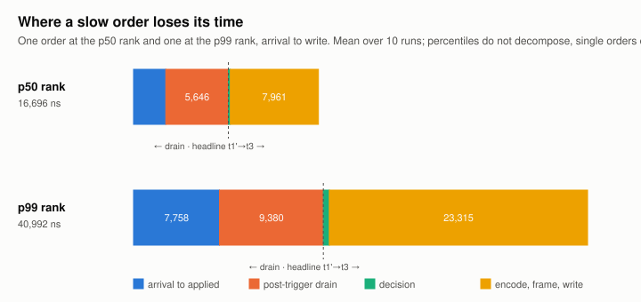
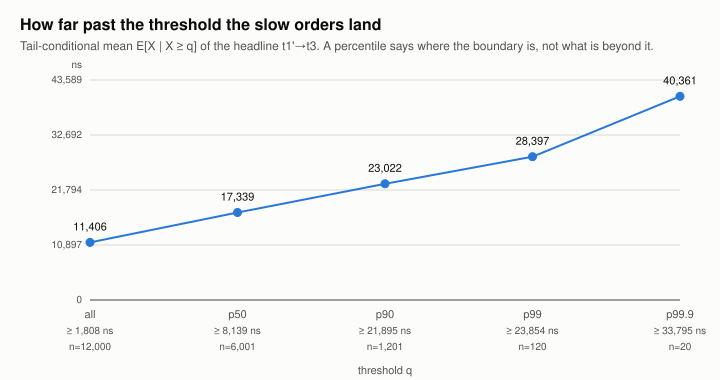

# Phase 12.8 — Tick-to-trade, decomposed. Results.

*Generated by `scripts/phase12-8-results.py` from `validation/tick-to-trade-baremetal.json`. Every number here is in that artifact; none is typed.*

Bare metal, MSFT 2019-12-30 replayed at 1000×, 10 repeats of 1,200 orders each. Two processes, two pinned cores, ITCH over UDP and OUCH over SoupBinTCP.

## The headline

**`t1'→t3`, post-drain decision to the write that puts the order on the wire, is 8,169 ns at p50** over 12,000 samples, 95% CI [8135, 8206] normal.

It moved **1.8%** across the 10 repeats and a permutation test cannot tell the runs apart (p = 0.71). It is entirely strategy-local: five stamps taken by one thread on one core, carrying no cross-process clock error at all.

**This is not the plan's `t0→t3`, and the difference is not cosmetic.** The quote block reads the book *after* the drain, so the message that crosses the quote counter has no causal role in the order it would have anchored. `t0→t3` — arrival to write, including the drain — is 20,026 ns at p50, and the 11,857 ns between them is drain, not reaction.

## Chain A — the reaction path

| hop | n | p50 ns | p99 ns | interval | run spread | pools |
|---|---:|---:|---:|---|---:|:--:|
| `t0->t1   arrival to applied` | 12,000 | 2,803 | 12,354 | [2771, 2844] normal | 5.4% | yes |
| `t1->t1'  post-trigger drain` | 12,000 | 6,106 | 32,508 | [5969, 6229] normal | 10.8% | yes |
| `t1'->t2  decision` | 12,000 | 244 | 742 | [105, 267] runs | 64.0% | **no** |
| `t2->t3   encode, frame, write` | 12,000 | 8,036 | 23,357 | [8001, 8067] normal | 1.9% | yes |
| `t3'->t4  parse, validate, submit` | 12,000 | 2,515 | 13,701 | [2447, 2578] normal | 18.8% | yes |
| `t1'->t3  HEADLINE reaction path` | 12,000 | 8,169 | 23,837 | [8135, 8206] normal | 1.8% | yes |
| `t0->t3   arrival to write (incl. drain)` | 12,000 | 20,026 | 59,983 | [19669, 20420] normal | 9.9% | yes |

`t2→t3` at 8,036 ns dominates the headline, and it is **the write, not the encode**: the decision itself (`t1'→t2`) is 244 ns. The hop is named for what it contains and the encode is a rounding error inside it. What that write actually spends its time on is the subject of the next section.

## Where the tail comes from

Percentiles do not decompose — the p99 of a sum is not the sum of the p99s — so this is built from **single orders**: the one sitting at the p50 rank of the headline and the one at the p99 rank, averaged over the 10 runs.

| hop | p50-rank order | p99-rank order | ratio |
|---|---:|---:|---:|
| `t0->t1` | 2,776 ns | 5,825 ns | 2.1× |
| `t1->t1'` | 6,340 ns | 8,842 ns | 1.4× |
| `t1'->t2` | 128 ns | 417 ns | 3.3× |
| `t2->t3` | 8,039 ns | 23,649 ns | 2.9× |
| **headline `t1'→t3`** | **8,168 ns** | **24,067 ns** | **2.9×** |

**The tail is the write.** `t2→t3` carries almost all of it while the decision stays flat in absolute terms — a slow order is not one that thought harder, it is one whose `write()` took longer. The drain (`t1→t1'`) moves too, but it sits *before* the headline's start stamp and so contributes nothing to `t1'→t3`.

A percentile says where a boundary is and nothing about what lies past it. Conditioned on crossing p99 (24,067 ns), the mean order takes 27,659 ns; conditioned on crossing p99.9 (31,662 ns) it takes 37,975 ns. The tail keeps going after the percentile stops looking.

## The transport hop is a bracket, and here is why

`t3→t3'` — the strategy's write to the exchange's read — came out **negative for 3,269 of 12,000 orders**, worst −9,928 ns, against a cross-core clock offset bounded at 52.5 ns. A hop cannot be negative, and the clock is 189× too small to explain it.

It is neither the clock nor the join. Three things were checked and ruled out before the fourth was accepted:

| candidate | ruled out because |
|---|---|
| stamp sharing (one syscall covering several orders) | 12,000 distinct `t3` and 12,000 distinct `t3'` over 12,000 orders — cleanly 1:1 |
| a mis-paired join | pairing by token and pairing by TCP-FIFO rank give *identical* results, and `ref_seq` agrees with the index for every order |
| the clock | the offset is bounded at 52.5 ns and the negatives run to 9,928 |
| **stamp placement** | **`t3` is taken *after* `::write()` returns** |

Linux delivers loopback synchronously **in the sender's own call stack**. The exchange, busy-polling on the other core, becomes runnable and stamps `t3'` partway through the strategy's `write()` — before that call has returned to stamp `t3`. So `t3` does not mark the send; it marks the writer finishing its syscall, which is strictly later.

That account makes a prediction that could have failed and did not:

- the send lies inside `(t2, t3)`, so **`t2 → t3'` must never be negative** — it is positive for all 12,000 orders;
- the shortfall can never exceed the window the send happened in — **0 of 3,269 negatives exceed it**;
- and the UDP side, which stamps `t5b` *before* `::sendto`, should show none of this — it has **0 negatives in 20,841 fills**.

So the transport is reported as an interval rather than a point. The true send instant lies between the two stamps and this harness cannot say where:

| hop | n | p50 ns | p99 ns | interval | run spread | pools |
|---|---:|---:|---:|---|---:|:--:|
| `t3->t3'  transport, LOWER bound` | 12,000 | 1,728 | 47,264 | [1702, 1755] normal | 7.0% | yes |
| `t3pre->t3' transport, UPPER bound` | 12,000 | 9,837 | 62,377 | [9763, 9894] normal | 1.8% | yes |

**Loopback TCP transport ∈ [1,728, 9,837] ns at p50.** The upper end uses `t2` because these traces predate the fix; `include/itchbook/bench/trace.hpp` now carries a `t3_pre` stamp taken immediately before the syscall, so the next boot brackets it tightly. Narrowing it further would need a stamp inside the kernel, which this harness does not have.

One consequence worth stating plainly: because delivery happens inside `write()`, part of what `t2→t3` charges to the strategy is really the kernel handing the packet to the peer. On a real NIC that cost is a doorbell write and the split would fall elsewhere.

## Chain B — the fill report

| hop | n | p50 ns | p99 ns | interval | run spread | pools |
|---|---:|---:|---:|---|---:|:--:|
| `tA->t5a  aggressor walk and match` | 20,841 | 955 | 18,754 | [927, 984] normal | 13.5% | yes |
| `t5a->t5b PACKING DELAY (--mtu)` | 20,841 | 21,543 | 1,296,067 | [20039, 22581] runs | 11.7% | **no** |
| `t5b->t6' loopback UDP` | 20,841 | 21,391 | 157,005 | [20899, 21934] normal | 17.2% | yes |
| `t6'->t6  drain, sequence, parse, apply` | 20,841 | 3,268 | 15,042 | [3227, 3310] normal | 6.1% | yes |

**The packing delay dominates at 21,543 ns**, an order of magnitude above the aggressor walk that produces the fill (955 ns). It is the time a fill's ITCH `'E'` waits for the feed behind it to fill the datagram — a function of `--mtu`, not a property of the exchange. The plan folds this into "match + ITCH publish", where it would have been a hop nobody could explain.

## The machine

| | |
|---|---|
| governor | `performance`, set by the harness and **verified** after |
| scheduler | *holds a CPU*: no gap over 100 µs on either pinned core |
| clocksource | `tsc` at start and end, unchanged |
| cross-core offset | not distinguishable from zero, bounded at 52.5 ns |
| gap-overlap census | present in every run: True |

Every chain-A `p99.9` over all chains **equals** its gap-free value exactly, so the tail is the code and not the scheduler. On this many samples that is a statement the census could have contradicted.

## What this does not establish

**The run is marked not-quotable in its own artifact**, for reasons recorded rather than argued away:

- [harness] the working tree is dirty: the binaries may not be the commit
- the repeats are not one experiment (see pooled)

2 of 13 hops fail to pool: `t1'->t2  decision`, `t5a->t5b PACKING DELAY (--mtu)`. `t1'→t2` has a median of 244 ns and a run-to-run spread of 162, so the effect is real but small in absolute terms; the headline and both transport bounds pool.

**A prediction the design made, falsified.** §7.2 said the reaction path should be flat across `--multiplier` while only the resting interval scaled — a hop that moves with the pacing knob is measuring the tape rather than the machine. It moves:

| `--multiplier` | headline `t1'→t3` p50 |
|---:|---:|
| 500 | 19,293 ns |
| 1000 | 8,169 ns |
| 2000 | 5,855 ns |

Monotone, and in the direction where a *slower* feed gives a *slower* reaction. The plausible mechanism is cache and branch-predictor warmth: at 2000× the loop is hot and everything it touches is resident; at 500× it idles between quotes and pays to fault it all back in. That makes the headline a function of offered load and not a constant of the code, which is worth knowing and was not the prediction.

## Provenance

`validation/tick-to-trade-baremetal.json` carries the per-run reports, the pooling, and the harness's own on-machine verdict. Every number above was **re-derived from the raw traces** by `scripts/phase12-8-report.py` after the boot.

The harness verdict inside that artifact is the one written **on the machine, at boot time**, and it predates the explanation above: its per-run notes still read the negative transport hop as two processes being descheduled relative to each other. That reading was wrong and is kept rather than edited, because an artifact that is quietly corrected after the fact is not evidence of anything.

The first boot, which ran at the powersave governor and is not usable, is kept as `validation/tick-to-trade-2026-08-28-powersave.json`.

