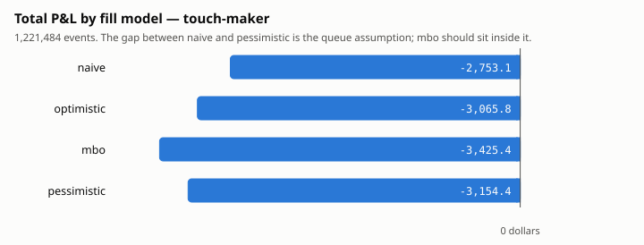
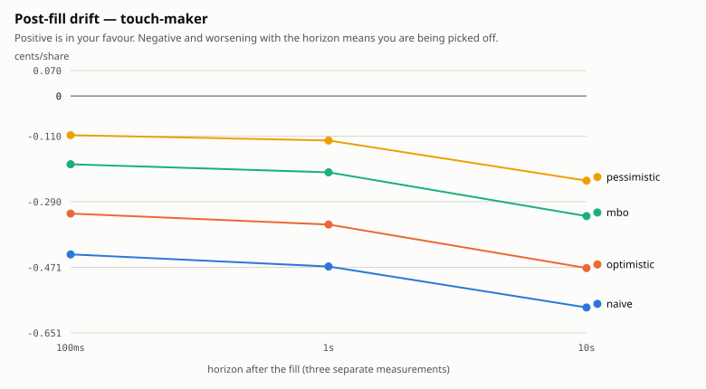
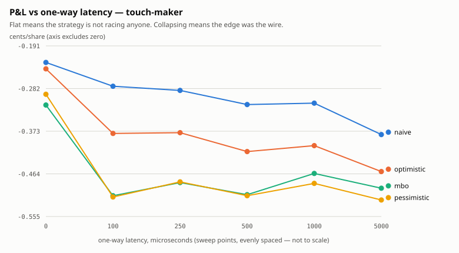
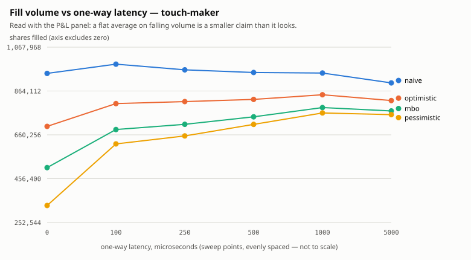
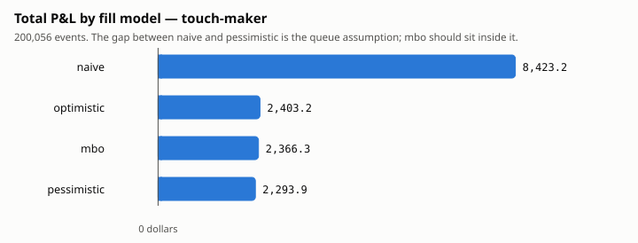
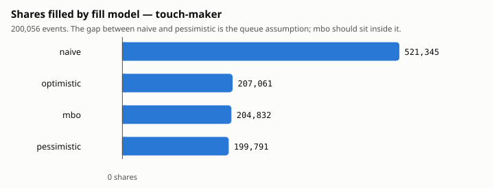
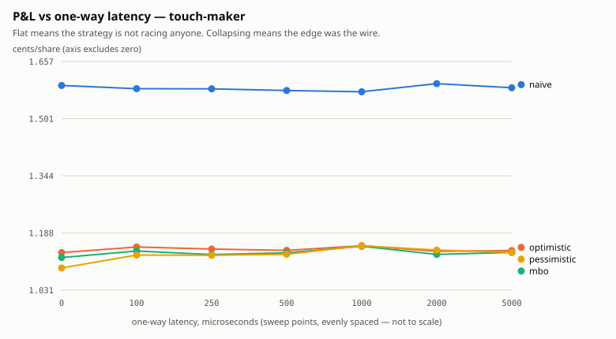
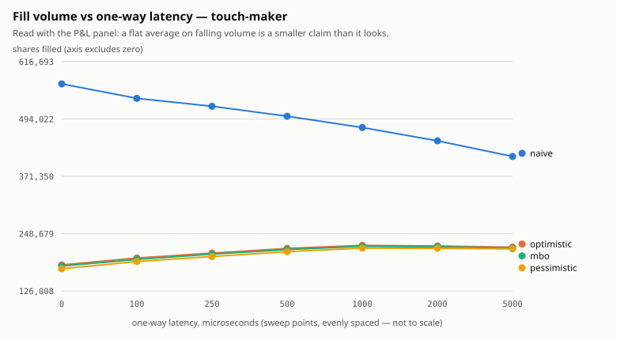

# Phase 6 — Queue-position backtester: results

One strategy and one set of bytes are run through four fill models in a single
pass. The difference between those models is the quantity this phase exists to
measure, and every figure below can be reproduced from the commands given in
each section.

Section 1 runs on **real NASDAQ TotalView-ITCH**: MSFT, 30 December 2019,
1,221,484 messages. Sections 2 onward run on a synthetic feed. They exist to
show that the machinery measures what it claims to measure, on data whose
answers are known in advance. Section 8 records which conclusions survive the
substitution and which do not. One of them did not survive, and that is the
most useful thing in this document.

---

## 1. On real data: MSFT, 30 December 2019

```
./scripts/real-data-run.sh 12302019.NASDAQ_ITCH50.gz MSFT 50
```

1,221,484 messages, sliced out of the full day. The strategy is the same one
used everywhere else: a symmetric maker at the touch quoting 100 shares a side.
It is held to a 1,000-share position limit, at 250 µs one-way latency.

| model | fills | shares | P&L | c/share | edge c/sh | fees c/sh |
|---|---:|---:|---:|---:|---:|---:|
| naive | 14,995 | 962,594 | −$2,753.09 | −0.2860 | 0.2649 | −0.0308 |
| optimistic | 12,261 | 814,786 | −$3,065.75 | −0.3763 | 0.0841 | −0.0308 |
| mbo | 9,892 | 709,308 | −$3,425.35 | −0.4829 | −0.1102 | −0.0307 |
| pessimistic | 8,548 | 655,232 | −$3,154.44 | −0.4814 | −0.2179 | −0.0307 |



**It loses money in every model.** The phase's stated done-condition is to "run
a strategy you know is unprofitable and confirm it loses money", and here that
condition is met on a real day rather than by construction. Naive still
flatters: it reports $401.34 more than pessimistic. The size of that flattery is
nothing like the synthetic feed's, though, and the shape of the result differs
in a way that deserves to be stated.

### The claim that did not survive

On synthetic data naive reported **3.53×** the P&L of pessimistic. On MSFT the
ratio is 0.87. The ratio is the wrong statistic here, because both numbers are
negative, and a ratio of two negative numbers says nothing about which one is
flattering. The tooling printed `0.87x` under a caption that called it "the cost
of assuming you are at the front of every queue", and that caption was false.
The signed difference is reported instead, and it means the same thing in both
regimes.

The 3.53× in section 2 is therefore a fact about a generator. What survives is
the direction: naive over-fills, and its P&L is the most flattering of the four.
That direction is confirmed independently in the next subsection. The magnitude
does not transfer, and this document previously implied that it did.

### Adverse selection, measured

This is the number that no synthetic feed here could honestly produce. Drift is
measured in cents per share, signed so that positive is in our favour.

| model | 100 ms | 1 s | 10 s | edge + drift @10s |
|---|---:|---:|---:|---:|
| naive | −0.4352 | −0.4684 | −0.5810 | −0.3161 |
| optimistic | −0.3230 | −0.3531 | −0.4725 | −0.3884 |
| mbo | −0.1876 | −0.2097 | −0.3300 | −0.4402 |
| pessimistic | −0.1076 | −0.1222 | −0.2326 | −0.4505 |



Drift is negative at every horizon and in every model, and it worsens as the
horizon lengthens. The strategy loses because it is picked off: the fills arrive
disproportionately just before the price moves against them. On the synthetic
feed this column is positive, because that generator's price mean-reverts.
Section 7 measures the generator, and this table measures a market.

### Why edge and drift trade places

`edge` goes from +0.2649 (naive) to −0.2179 (pessimistic), while `drift` moves
the other way. The two models book the same economic event in different columns.
The mechanism shows up in the fill counts:

| model | fills | lock fills | lock share | clamp events |
|---|---:|---:|---:|---:|
| naive | 14,995 | 1,722 | 11% | 75,402 |
| optimistic | 12,261 | 3,052 | 25% | 0 |
| mbo | 9,892 | 4,053 | 41% | 0 |
| pessimistic | 8,548 | 4,697 | 55% | 71,371 |

A *lock* fill is a fill by price priority: the other side crossed into our
resting quote. Naive fills early from ordinary flow and has usually left before
that happens. Pessimistic denies itself those ordinary fills, so it is still
resting when the cross arrives, and **55% of its fills come from being crossed
into**. A cross compresses the mid at the instant of the fill, so the adverse
move is already in the price and lands in `edge` as a negative number instead of
appearing in `drift` later. The event is the same and only the column differs.
`edge + drift` at 10 s keeps the expected order: naive −0.32, pessimistic −0.45.

More than half of pessimistic's fills arriving by price priority deserves to be
said plainly: **on this strategy and this day, the pessimistic lane mostly
measures what happens to a quote that never advances, and not a queue
assumption.** Being at the back of a queue really does have that property, so
this is not an artefact, although it is also not the quantity the four-model
comparison was designed to isolate.

The clamp column is a consistency signal. A clamp fires when a model's idea of
the shares ahead exceeds what is provably resting at the price. Naive never
decrements `ahead`, and pessimistic assumes every cancel is behind us, so both
drift above reality constantly. Optimistic decrements on every cancel and `mbo`
resolves references exactly, and both clamp **zero times in 1.2 million
messages**. A bound that never has to be corrected was a correct bound.

### The external check on real orders

200 MSFT orders that were pulled part-filled are the discriminating cases. Each
is shadowed one message ahead of its own add and graded against what it actually
filled. The day contains 2,011 such orders; these are 200 of them, drawn from
576,026 orders across 1,221,484 messages:

```
./scripts/real-data-run.sh <day>.gz MSFT 200
```

| model | mean error | mean abs error | over | under | exact |
|---|---:|---:|---:|---:|---:|
| naive | +23.6 | 23.6 | 89 | 0 | 111 |
| optimistic | +12.0 | 12.0 | 47 | 0 | 153 |
| mbo | 0.0 | 0.0 | 0 | 0 | **200** |
| pessimistic | -27.9 | 27.9 | 0 | 96 | 104 |

The truth totals 12,189 shares over the 200 orders, or 61 per order. An earlier
run at the default 50 samples gave the same shape: naive over by 24 and never
under, pessimistic under by 21 and never over, and `mbo` exact on all 50. The
result is therefore not an artefact of which orders were sampled.

**`mbo` reproduced all 200 exactly, and 200/200 fell inside
[pessimistic, optimistic].** Naive over-fills and never under-fills;
pessimistic under-fills and never over-fills. Of everything in the phase, this
result matters most, because it is the only one measured against ground truth
rather than against another implementation of the same idea. It also holds on
real orders, with real icebergs and real replaces, and not only on a generator.

It settles the P&L inversion above as well: the queue machinery is correct on
this data, so the inversion is a fact about MSFT and this strategy and not a bug.

### Latency

| model | c/share @0 µs | change to 5 ms | shares |
|---|---:|---:|---:|
| naive | −0.2262 | −0.1541 | ×0.95 |
| optimistic | −0.2399 | −0.2194 | ×1.17 |
| mbo | −0.3172 | −0.1777 | ×1.52 |
| pessimistic | −0.2942 | −0.2259 | ×2.28 |

Every model gets worse per share as latency rises, and the queue models fill
*more*. Pessimistic more than doubles its volume between 0 µs and 5 ms. The
mechanism is the one section 5 describes on synthetic data, larger here.
`TouchMaker` requotes whenever the touch moves, and a replace goes to the back
of the queue, so latency slows the churn and each order rests longer and climbs
further. For a strategy that loses money, filling more means losing more. The
rising share count and the worsening per-share number are the same fact recorded
twice.




Both panels appear for the reason the table gives: the per-share number worsens
while the share count climbs, and either panel on its own shows half of that.

The argument here is that `TouchMaker` requotes too eagerly, and not that slow
infrastructure is desirable. It is visible at all only because the queue models
charge for a replace.

---

## 2. The headline

```
./build/queue_backtest data/raw/queue_long.gz --strategy touch-maker \
    --max-position 1000 --json docs/figures/touch-maker.json
python3 python/analysis/fill_comparison.py docs/figures/touch-maker.json \
    --svg docs/figures/fills-total.svg
```

Synthetic data, 200,056 events, with the same strategy and settings as
section 1. The point of this section is that the machinery separates the models
at all on data whose behaviour is known in advance, and the P&L itself is
secondary.

| model | fills | shares | P&L | c/share | edge c/sh | fees c/sh |
|---|---:|---:|---:|---:|---:|---:|
| naive | 7,538 | 458,904 | $7,262.78 | 1.5826 | 1.3436 | −0.0908 |
| optimistic | 2,786 | 189,696 | $2,173.15 | 1.1456 | 0.9664 | −0.0911 |
| mbo | 2,721 | 188,326 | $2,130.51 | 1.1313 | 0.9582 | −0.0911 |
| pessimistic | 2,683 | 182,535 | $2,052.86 | 1.1246 | 0.9471 | −0.0911 |

**Naive claims 3.53× the P&L of pessimistic** *on this generator*. Section 1
shows that the multiple does not transfer to a real day, although the direction
does. Volume accounts for nearly all of it: naive reports 2.5× the shares.

These numbers moved once, and the reason is recorded here rather than the
figures being quietly restated. Phase 7 added halts to the feed generator, so
the same seed now produces a different feed, and the figures here were
regenerated against it. The simulator did not change. Given the pre-halt
generator's feed, the current code reproduces the previously published numbers
exactly, fill for fill. A synthetic result is only ever a result about the
generator, and this is what that means in practice. The rest is worse: naive
also claims a third more edge *per share*, because the fills it invents happen at
moments the queue never actually reached, and those are systematically the good
moments.

`mbo`, which resolves order references instead of guessing, sits inside the
optimistic/pessimistic band. That check is what establishes the band as a band,
rather than two arbitrary numbers with a gap between them.




Both panels are here deliberately. Per share the four models agree to within a
tenth of a cent, so a per-share chart alone shows four identical bars and hides
the entire result.

---

## 3. The external check: shadow real orders

Everything in section 2 is internal. Two implementations that agree, and
invariants that hold, would both pass if the implementation were wrong in a
consistent way. This check is the one whose answer does not come from us.

```
python3 python/analysis/leave_one_out.py data/raw/queue_long.gz \
    --binary build/queue_sim --samples 200 --partial-only
```

For a real order O, the feed is replayed **unchanged** with a simulated order of
O's price and size placed one message before O's add, so that it stands where O
stood with the same queue ahead of it, and pulled one message before whatever
removed O. The feed says how many of O's shares filled. The two are compared.

Because nothing is edited, no other participant's behaviour changes and the
queue ahead is the real queue. O sits directly behind us, so every execution the
tape addresses to O is flow that reached the front of that queue while we were
at the front of it.

200 orders that were pulled **part-filled** are the discriminating cases. An
order that ended fully executed grades every model perfect and measures nothing:

| model | mean error | mean abs error | over | under | exact |
|---|---:|---:|---:|---:|---:|
| naive | +57.9 | 57.9 | 152 | 0 | 48 |
| optimistic | +28.9 | 28.9 | 79 | 0 | 121 |
| **mbo** | **0.0** | **0.0** | **0** | **0** | **200** |
| pessimistic | −62.3 | 62.3 | 0 | 108 | 92 |

**Bracketed by [pessimistic, optimistic]: 200/200.** The band is a bound.

`mbo` is exact on every one of the 200. `naive` over-fills by 40% of the average
order and never under-fills. Theory predicts that shape, because a model which
ignores the queue can only ever be at least as filled as one that waits.

The value of this check became clear as soon as the feed gained halts. Phase 7
taught the generator to halt a symbol, and this table immediately fell to
**189/200**, with `mbo` under-filling 42 times where it had been exact on every
one before. A real defect caused it. `commit()` returned outright while a symbol
was halted, so the models ignored the cancels and deletes that kept arriving
through the halt, and they emerged from it still believing that a queue which no
longer existed stood in front of them. Trading is gated during a halt and
bookkeeping is not. The two are easy to conflate, and the mistake is invisible
on a feed that never halts. Both implementations now advance on cancels while
halted and fill on nothing, which the differential test insisted on: the C++ fix
alone made the two disagree within one run.

The oracle found two defects in the feed generator before it found anything
about the models, and both were real:

* Executions were happening at randomly chosen price levels. No single venue
  produces a tape in which a print sits below a resting bid, and the simulator
  was then *correct* to fire price priority on nearly every fill: a shadow order
  took 100 shares where the order it shadowed took 23.
* Executions were happening through halts. A halted symbol does not trade, so
  the models correctly ignored those messages, their idea of what was ahead
  stopped matching the book, and they reported zero for the rest of the
  order's life.

---

## 4. The closed form: a feed where every fill is adverse

```
python3 python/make_toxic_feed.py data/raw/toxic.gz --episodes 40
./build/queue_backtest data/raw/toxic.gz --strategy touch-maker --json toxic.json
python3 python/make_toxic_feed.py --check toxic.json --episodes 40
```

The feed is built so that every quantity is fixed before the simulator runs.

| model | fills | shares | edge c/sh | drift 100ms | drift 1s | drift 10s | unresolved | residual |
|---|---:|---:|---:|---:|---:|---:|---:|---:|
| naive | 40 | 4,000 | 1.0000 | −2.0000 | −2.0000 | −2.0000 | 0 | 0 |
| optimistic | 40 | 4,000 | 1.0000 | −2.0000 | −2.0000 | −2.0000 | 0 | 0 |
| mbo | 40 | 4,000 | 1.0000 | −2.0000 | −2.0000 | −2.0000 | 0 | 0 |
| pessimistic | 40 | 4,000 | 1.0000 | −2.0000 | −2.0000 | −2.0000 | 0 | 0 |

Gross P&L is **exactly zero** in every lane. Each fill is worth minus one cent
measured against the mid ten seconds later, and yet the realized round trip
returns nothing either way: we buy the bid at mid − 1 tick, the mid drops two
ticks, and the ask we then sell at is the new mid + 1 tick, which is the same
price. A two-tick spread against a two-tick adverse move nets zero. That is the
textbook statement of what adverse selection does to market making, and the
rebate is all that remains. A markout and a P&L answer different questions.

All four models agree here, because the feed contains no queue ambiguity. A
backtester whose models disagreed on this feed would be finding ambiguity that
came from its own implementation.

---

## 5. Latency

```
./build/latency_sweep data/raw/queue_long.gz --strategy touch-maker \
    --max-position 1000 --csv docs/figures/latency-touch-maker.csv
python3 python/analysis/latency_sweep.py docs/figures/latency-touch-maker.csv \
    --svg docs/figures/latency-pnl.svg --shares-svg docs/figures/latency-shares.svg
```

Shares filled, by one-way latency:

| model | 0 µs | 100 µs | 250 µs | 500 µs | 1 ms | 2 ms | 5 ms |
|---|---:|---:|---:|---:|---:|---:|---:|
| naive | 492,497 | 469,104 | 458,904 | 441,889 | 418,320 | 398,123 | 375,290 |
| optimistic | 164,166 | 181,200 | 189,578 | 202,817 | 209,496 | 211,208 | 207,317 |
| mbo | 161,741 | 179,528 | 188,156 | 201,286 | 207,737 | 210,319 | 207,039 |
| pessimistic | 156,455 | 174,501 | 182,513 | 198,045 | 204,810 | 206,757 | 205,123 |

P&L, by one-way latency:

| model | 0 µs | 100 µs | 250 µs | 500 µs | 1 ms | 2 ms | 5 ms |
|---|---:|---:|---:|---:|---:|---:|---:|
| naive | $7,840 | $7,426 | $7,263 | $6,973 | $6,587 | $6,357 | $5,950 |
| optimistic | $1,862 | $2,083 | $2,169 | $2,312 | $2,415 | $2,402 | $2,363 |
| mbo | $1,812 | $2,044 | $2,124 | $2,281 | $2,392 | $2,375 | $2,349 |
| pessimistic | $1,708 | $1,967 | $2,057 | $2,237 | $2,361 | $2,359 | $2,327 |

Two directions are visible in those tables.

**Naive decays with latency and the queue models improve.** Naive loses 27% of
its fills between 0 and 5 ms. Its fills come from being present when a trade
prints at its price, and arriving later means being present less often. The
queue models gain 24%. This strategy requotes whenever the touch moves, and a
replace goes to the back of the queue, so latency slows the churn and each order
rests longer and climbs further. Under a model where queue position is real,
being slower to requote is worth something.

The argument is that TouchMaker requotes too eagerly, not that slow
infrastructure is desirable, and it is visible at all only because the queue
models charge for a replace.




Neither curve collapses toward zero, so nothing here amounts to a latency edge.

`patient-maker`, which joins the touch and holds until the price moves five
ticks away, sharpens that reading. Its fills are *identical* at 0 µs, 250 µs and
1 ms, at 4,300 / 4,200 / 4,200 shares for optimistic / mbo / pessimistic at
every one of those points, and they move only at 100 ms and 1 s. An order that
rests for seconds is unaffected by microseconds, and a flat line says so more
usefully than a single number at one latency. Volume is the price of that
flatness: it fills 4,300 shares where touch-maker fills 207,000, because it
holds one quote a side instead of following the touch.

---

## 6. The controls

A backtester that cannot produce a loss is broken.

**Crossing the spread every N events** (`--strategy crosser`), 33,831 shares:

| P&L | c/share | edge c/sh | fees c/sh |
|---:|---:|---:|---:|
| −$714.11 | −2.1108 | −1.5407 | +0.4099 |

The result is identical in all four models, to the cent. Crossing the spread is
not a queue question, so a difference between lanes here would mean that
fill-model state had reached the taker path.

**Quoting 200 ticks from the touch** (`--strategy far-quoter`): zero fills, zero
P&L, in every model. Any fill there would mean the simulator reached a price the
market never traded at.

**Quoting nothing** (`--strategy null`): zero fills, zero P&L, zero residual.

A unit test covers the analytic anchor as well: a taker lifting a two-cent
spread must show an edge of exactly −1.0000 cents per share. If it does not,
either the ledger's sign convention or its mid arithmetic is wrong, and nothing
else the ledger reports can be trusted.

---

## 7. Adverse selection on this feed

```
python3 python/analysis/markout.py docs/figures/touch-maker.json \
    --svg docs/figures/markout.svg
```

| model | edge c/sh | 100 ms | 1 s | 10 s | unresolved |
|---|---:|---:|---:|---:|---:|
| naive | 1.3515 | +0.1212 | +0.1765 | +0.1712 | 519 |
| optimistic | 1.0162 | +0.0348 | +0.0947 | +0.0655 | 234 |
| mbo | 1.0079 | +0.0360 | +0.0948 | +0.0635 | 217 |
| pessimistic | 1.0021 | +0.0331 | +0.1087 | +0.0678 | 220 |

**The drift is positive, which means this feed does not exhibit adverse
selection at all.** That is a property of the generator rather than a finding
about market making. Its centre is a driftless random walk and its levels refill
after a sweep, so the mid tends to return to where it was. A maker filled during
the sweep is marked at the bottom of it and then sees the price recover.

The right conclusion is narrow. The markout machinery is wired correctly, since
the toxic feed in section 3 returns exactly −2.0000 cents at every horizon on
demand, and this particular synthetic price process is not toxic. What real data
does remains an open question until real data is run.

The `unresolved` column holds fills with no ten-second future left in the data.
They are counted rather than dropped, because excluding them silently biases the
long horizon toward whatever the middle of the session looked like.

---

## 8. What this does and does not establish

Established on **real data** (section 1):

* The band is a bound and `mbo` is exact. 200/200 real MSFT orders fell inside
  [pessimistic, optimistic], and `mbo` reproduced all 200 exactly. Naive
  over-filled 89 times and under-filled never; pessimistic under-filled 96 and
  over-filled never. The same held at the default 50 samples (50/50, 24 over,
  21 under), so it is not a fact about which orders were drawn.
* A passive maker at the touch is adversely selected. Drift is negative at
  100 ms, 1 s and 10 s in every model and worsens with the horizon.
* The strategy loses money, which is the phase's done-condition.
* Naive is the most flattering of the four, by $401 on the day.

Established on synthetic data, where the answer was known in advance:

* The four models are ordered, and 200/200 synthetic orders fell inside the
  band with `mbo` exact.
* The ledger's arithmetic is exact where an exact answer exists: −1.0000 cents
  of half-spread for a taker, +1.0000 edge and −2.0000 drift on the toxic feed,
  gross P&L of exactly zero on a round trip at the same price.
* Latency changes fills in both directions and the harness measures both.
* A position limit is enforced per lane and never breached.

Did **not** survive contact with real data:

* **The 3.53x headline** (3.67x before the generator gained halts; it moved
  because the feed did, which is itself the point). It is a property of the
  generator. On MSFT the gap is
  $401 on a $3,000 loss, and the ratio inverts to 0.87 because both numbers are
  negative. The direction transfers and the magnitude does not. The tooling
  reported that ratio under a caption calling it "the cost of assuming you are
  at the front of every queue", which was flatly wrong for a losing strategy.
  A signed difference is reported now, and it means the same thing either way.
* **The markout signs.** Positive on the synthetic feed (section 7), negative
  at every horizon on MSFT. The generator mean-reverts; a market does not.

Still open, and one day of one symbol does not settle it:

* Whether the MSFT result generalises. This is one name on one day,
  30 December 2019, in a thin week between the holidays. A liquid mega-cap in a
  quiet session is close to the best case for a touch maker, and it still lost.
  The result is suggestive and not general.
* Whether more than half of pessimistic's fills arriving by price priority is
  typical, or specific to a strategy that requotes on every touch move. A
  patient maker would answer that and has not been run on real data.
* Whether a real day's cancels sit nearer the optimistic or the pessimistic
  bound. The leave-one-out errors, optimistic +9.0 shares and pessimistic −25.4,
  say optimistic on a sample of 50. A larger sample would tighten that.

Known modelling limits, recorded here rather than in a footnote:

* A replace resets the ahead-count from the book, which breaks the induction
  the optimistic model relies on when an iceberg refreshes.
* Two of our own orders at one price make the clamp limit model-dependent.
* Hidden prints are treated as consuming nothing, which is right for real
  non-displayed liquidity and wrong if a venue's print attribution differs.
* With a position limit in force the four lanes no longer send identical
  orders: a lane that filled more suppresses more quotes. The comparison
  becomes "one strategy, four fill models, each with its own risk state",
  which is the honest version of a market-making backtest and a different
  experiment from the unlimited one.

---

## 9. Reproducing all of it

```
cmake -S . -B build -DCMAKE_BUILD_TYPE=Release && cmake --build build -j
python3 python/make_queue_feed.py data/raw/queue_long.gz --messages 200000 \
    --gap-ns 300000 --seed 7

./build/queue_backtest data/raw/queue_long.gz --strategy touch-maker \
    --max-position 1000 --json docs/figures/touch-maker.json
python3 python/analysis/fill_comparison.py docs/figures/touch-maker.json \
    --svg docs/figures/fills-total.svg
python3 python/analysis/fill_comparison.py docs/figures/touch-maker.json \
    --metric shares --svg docs/figures/fills-shares.svg
python3 python/analysis/markout.py docs/figures/touch-maker.json \
    --svg docs/figures/markout.svg

./build/latency_sweep data/raw/queue_long.gz --strategy touch-maker \
    --max-position 1000 --csv docs/figures/latency-touch-maker.csv
python3 python/analysis/latency_sweep.py docs/figures/latency-touch-maker.csv \
    --svg docs/figures/latency-pnl.svg --shares-svg docs/figures/latency-shares.svg

python3 python/analysis/leave_one_out.py data/raw/queue_long.gz \
    --binary build/queue_sim --samples 200 --partial-only
```

CI runs the closed-form check and the leave-one-out oracle on every push, so
neither can decay unnoticed.

### On a real day

Everything above is synthetic. `scripts/real-data-run.sh` runs the same four
measurements against a real NASDAQ day and writes the tables and figures to
`out/real/`:

```bash
./scripts/real-data-run.sh 12302019.NASDAQ_ITCH50.gz MSFT 200
```

The script does two things that are easy to forget by hand. It **slices
first**: `queue_backtest` does not filter by symbol, so pointing it at a full
day would interleave eight thousand symbols into one book and produce confident
nonsense. It also builds **Release**, because the default Debug build has ASan
and UBSan on and runs about ten times slower, which on 1.2M messages is a large
difference in wall clock.

The last argument is the leave-one-out sample count. Each sample replays the
whole slice once, so 200 is worth doing although it is not a thirty-second job.
Start at 50.

Nothing under `data/` or `out/` is committed. Both are gitignored, because both
are derived from licensed data.
